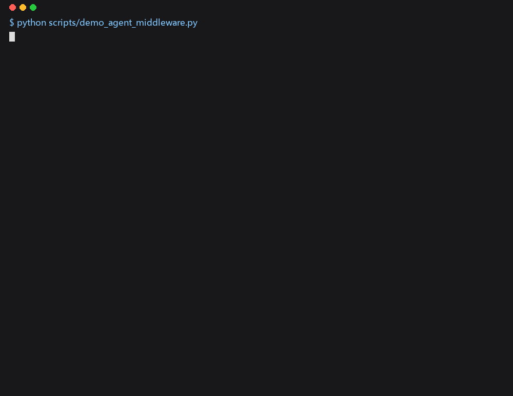

# Civil Buddy

[](https://github.com/LUOaini1213/civil-buddy/actions/workflows/ci.yml) [](https://github.com/LUOaini1213/civil-buddy/releases) [](LICENSE)

**Agentic AI Workspace for Engineering** — 土木版 Codex

Natural Language → Agent Routing → Deterministic Tools → HITL → Evaluation


**In one paragraph (EN)** — an agent workbench for civil / construction / tendering
work: 66 job-post skills (16 categories), each an SOP the model drafts against.
Hard numbers — coordinates, container counts, unit prices — come only from
deterministic tools; the model routes and drafts. High-risk actions (qualification
verdicts, bids, writes to disk) need a human confirmation. One skill, container
packing (`pack-ship`), has a real engine behind it and a 128-run automated
evaluation with its archive in the repo; the other 65 are SOP skills at the depth
the ladder below states. Rust workbench + MCP entry, Python packing harness,
FastAPI gateway. MIT.

**30 秒，无 Key** — 策略引擎 + 失败恢复的四拍剧本（正常放行 → 越权被拒 → 工具故障重试降级 → 成本超限熔断）：

```bash
pip install -r requirements.txt
python scripts/demo_agent_middleware.py     # 四拍剧本，输出见下
python scripts/test_agent_middleware.py     # 同一剧本的断言版（CI 每次提交都跑）
```



<details>
<summary>四拍剧本的实际输出（2026-09-03 本机，无 API Key）</summary>

```text
==========================================================
Civil Buddy · 策略引擎 + 失败恢复
==========================================================
两层 Runtime 中间件（不是五个平庸包装）
  1. 策略引擎  谁 / 哪个工具 / 花多少 / 能否碰生产数据
  2. 失败恢复  超时重试 → 降级 UNSPECIFIED → 审计链
剧本：正常下单 → 越权被拒 → 工具挂掉自动恢复 → 成本超限熔断

[1/4] 正常下单   ALLOW
  原因  低风险岗 finance-tax 写作业根
  结果  wrote=True  GST 9%=True  files=2  run=run-<id>

[2/4] 越权被拒   DENY
  原因  拒绝：岗 bid-parse 不能调 pack-ship__plan（exclusive 属于 pack-ship）。
  弹窗  拒绝：岗 bid-parse 不能调 pack-ship__plan（exclusive 属于 pack-ship）。
  密钥  拒绝：secret path denied: .env  文件未落地

[3/4] 工具挂掉自动恢复   DEGRADE
  原因  下游失败 timeout，工具 demo__downstream 降级，不编柜数/xyz。
  动作  degrade  审计 ['call', 'retry', 'degrade']
  结果  can_fit=UNSPECIFIED  不编柜数

[4/4] 成本超限熔断   CIRCUIT
  原因  熔断：session 成本超限 steps 1/1 tokens 32/32。
  代码  circuit_open  已执行=False

submit_blocked=true  secret_leak=false  禁止：可以投标 / 可以开工
```

</details>

**是什么** — 面向土木 / 施工 / 投标的 **66 岗（16 大类）工作台**：66 份 SOP 技能，其中装箱岗 pack-ship 有确定性引擎，其余按下表分级。每岗一份 `SKILL.md` 按 SOP 出稿；**硬数字（坐标、柜数、单价）只由确定性工具算**，模型负责路由和起草；资格、投标、写盘这类高风险动作**须人确认**。产出是内部讨论草稿，不是签认件。

**给谁用** — 物机 / 物流 / 投标岗的日常起草与装柜计算。装箱引擎 pack-ship 是其中一岗，也是前身独立仓 `packing-agent`（已并入本仓，旧链接自动跳转）。

**凭什么可信** — 每一条都有可复跑的命令：

| 证据 | 数字 | 复跑 |
|---|---|---|
| 66 岗诚实分级 | L1 知识库 66/66 · L2 工具写盘 36/66 · L3 引擎岗 1 | [docs/depth-ladder.md](docs/depth-ladder.md)（每级挂验收命令） |
| 自动化装箱评测 | **128** 次（16 并发 × 8 轮），2026-09-02 复跑 **128/128 PASS** | [留档](docs/eval/fanout16x8-2026-09-02/rollup.md)（128 条逐次记录）· `python scripts/fanout16x8_online_cargo.py`（联网抓公开货样约 4 分钟；`--skip-fetch` 用仓内 `data/external/fanout16x8/` 缓存可离线跑）· 本表数字由 `python scripts/render_eval_table.py --check README.md` 对留档核对（CI）· CI 每次提交跑 2 lane × 1 round 离线切片 |
| steps 主路径 vs LLM 自主调工具 | 影子评测（steps 臂 vs `llm_toolcall` 臂），CI 每次提交都跑 tiny 一例 | `python scripts/eval_workteams_cli.py --tiny-only`。**CI 里没有 Key**：llm 臂的工具选择走 `policy_fallback`（`harness._path_honesty` 会标出），CI 证明的是链路与两臂一致性检查，不是真模型的表现 |
| Agent 中间件四拍剧本 | 正常放行 → 越权被拒 → 工具故障重试降级 → 成本超限熔断 | `python scripts/demo_agent_middleware.py`（无需 Key）· 断言版 `python scripts/test_agent_middleware.py` 与 `npm run check` 在 CI 每次提交都跑 |
| 端到端金线 | 8/8（R13 时点实测，需 playwright，未进 CI） | `python scripts/r13_golden_path_e2e.py` |

**试用（零编译）** — 下载 [Releases](https://github.com/LUOaini1213/civil-buddy/releases) 的 **v0.4.0-workbench** zip → 双击 `start-workbench.bat`（浏览器自动打开 :8765）→「设置 → 模型设置」填自己的 Key（DeepSeek / z.ai / OpenAI 兼容任选，运行时生效）。
试用包**不含装箱引擎**；要看真柜数需源码起装柜台：`pip install -r requirements.txt` → `uvicorn gateway.app:app --port 8000`。边界见 [给试用的人.md](给试用的人.md)。

**提交署名说明** — 仓内约 40% 的提交署名为 `Packing Assistant`：agent 起草并落盘的改动独立署名，经人审后合入 `main`。这是 HITL 流程的一部分，不是第二位作者。

> 内部讨论草稿，不是法定专项方案、不是签认件。
> 高风险写盘前确认句：`我明白，将由持证人员签认`。

**竞赛材料（海之子杯 2026 · AI 智能体挑战）** — 评审维度对照、可复跑命令与 23 轮 UX 迭代记录移至 [docs/submission/haizizhi-entry.md](docs/submission/haizizhi-entry.md)；Agent Middleware 赛道对照表（**按赛题 checklist 自评**，非官方评审）见 [docs/civil-buddy/track1-qualified.md](docs/civil-buddy/track1-qualified.md)。

---

## 两套入口

| 入口 | 地址 | 用途 |
|------|------|------|
| **零编译试用** | Releases exe → :8765 | 双击即用；不含装箱引擎（边界见[给试用的人.md](给试用的人.md)） |
| **Civil Buddy 工作台** | http://127.0.0.1:8765 | 召唤专家、投标/施工草稿、装箱作业单 |
| **主线 C · 投标应答 + 交付** | http://127.0.0.1:8000 | 招标要点 → 响应矩阵 → 装柜证据（草稿） |
| **工程装柜台** | http://127.0.0.1:8000/workbench | 成箱 → HITL → 拼柜 3D / CoG |
| **用户路径 / PRD** | [prd-pack-ship.md](docs/civil-buddy/prd-pack-ship.md)（含 Mermaid 流程图，GitHub 直接渲染） | 流程图 + 验收表 |

### 1) Civil Buddy 工作台

```powershell
cd workbench
# API Key：启动后在界面「设置 → 模型设置」填即可（推荐）；或写 gitignored 的 demo/.env
cargo run --release --bin civil-workbench
```

Python 参考实现：`demo/`（`uvicorn app:app --host 127.0.0.1 --port 8765`）。

产品 CLI（土木版 Codex）：`python -m packing_assistant.civil`（TUI）· `python -m packing_assistant.civil app` · `python -m packing_assistant.civil mcp --pack construction`。技能一岗一份：`.agents/skills/<id>/SKILL.md`。IDE：`ide/README.md`。Grok 总控：`skills/civil-buddy`。  
**全量产品规划书**：[docs/civil-buddy/product-plan.md](docs/civil-buddy/product-plan.md)。切片执行：[product-completion-plan.md](docs/civil-buddy/product-completion-plan.md)。

### 2) 装箱引擎（pack-ship 的计算器）

```powershell
pip install -r requirements.txt
python scripts/demo_agent_middleware.py      # 冒烟（四拍剧本），无需 API Key；demo_one_shot.py 的 trace 断言回归待修，见 issues
python scripts/test_storage_ensure_run.py    # issue #22 回归：run_start 先于会话落盘时不再触发外键回退（CI 覆盖）
uvicorn gateway.app:app --host 127.0.0.1 --port 8000
```

工作台默认在同一仓库里找引擎：`PACKING_AGENT_ROOT` = 本仓根。也可另开网关：

```env
PACKING_AGENT_URL=http://127.0.0.1:8000
```

详见 [docs/civil-buddy/packing-agent.md](docs/civil-buddy/packing-agent.md)。

---

## 仓库结构

```
workbench/           # Civil Buddy Rust 工作台 + MCP
demo/                # 专家知识库 kb/ + Python 参考实现
.agents/skills/      # Codex：66 岗各一份 SKILL.md
skills/civil-buddy/  # Grok 总控 SOP
packing_assistant/   # 装箱 harness（Team A 成箱 + Team B 拼柜）
gateway/ + frontend/ # 装箱 HTTP / UI
docs/civil-buddy/    # 工作台设计、专家名册
docs/                # 装箱架构与产品主线
```

**原则（两套入口共用）：** tools compute numbers; the model only routes.

---

## 装箱引擎（原 packing-agent）

架构：**大 Team ⊃ Team A（成箱）+ Team B（拼柜）** · Harness 0.6.4  
NL → IntentSpec → 白名单 tools → HITL → 影子评测。


```powershell
python scripts/test_p0_p1_p2_full.py              # P0–P2 全链（CI 覆盖）
python scripts/eval_workteams_cli.py --tiny-only      # steps vs llm 影子评测（CI 覆盖）
```

文档：[docs/harness-design.md](docs/harness-design.md) · [docs/ARCHITECTURE.md](docs/ARCHITECTURE.md) · [docs/product-mainline-tender-delivery.md](docs/product-mainline-tender-delivery.md)

---

## 环境变量

复制 `.env.example` / `demo/.env.example`，不要提交密钥。

| 变量 | 说明 |
|------|------|
| `CIVIL_API_KEY` / `OPENAI_API_KEY` / `DEEPSEEK_API_KEY` | 成稿用的 Chat Completions Key（自选；DeepSeek 可选） |
| `CIVIL_API_BASE` / `OPENAI_BASE_URL` | 兼容网关，例 `https://api.openai.com/v1` |
| `CIVIL_MODEL` / `LLM_MODEL` | 模型名，须与网关一致 |
| `CIVIL_JOB_ROOT` | 授权作业文件夹（禁止 `D:\layout`） |
| `PACKING_AGENT_URL` | 装箱网关（可选） |
| `PACKING_AGENT_ROOT` | 默认本仓根，一般不用设 |
| `CIVIL_PORT` | 工作台端口，默认 8765 |

---

## 明确不做

桌面键鼠、微信/飞书、Rhino/Civil3D 改模、注册工程师签认、编造条款/单价/xyz。规范全文不进仓库。
