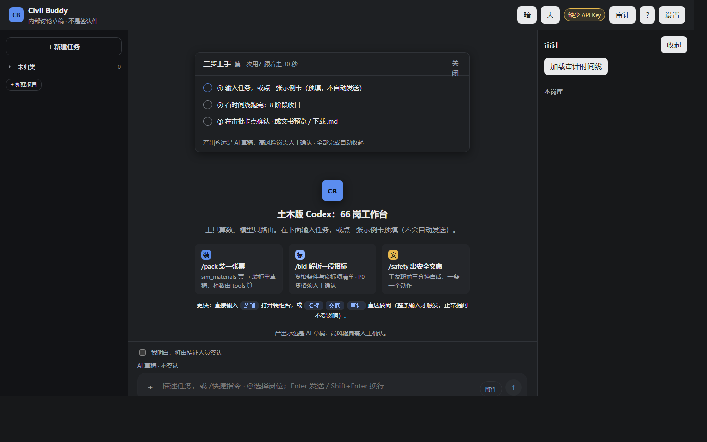
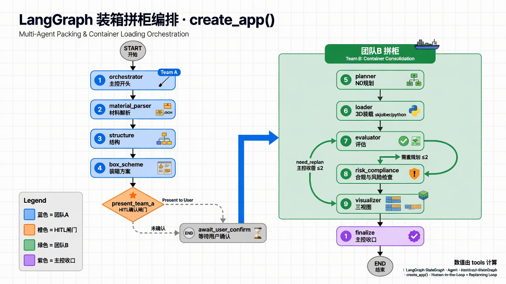

# Civil Buddy

[](https://github.com/LUOaini1213/civil-buddy/actions/workflows/ci.yml) [](https://github.com/LUOaini1213/civil-buddy/releases) [](LICENSE)

**Agentic AI Workspace for Engineering**

Natural Language → Agent Routing → Deterministic Tools → HITL → Evaluation

66-role AI workflow system for civil / construction / tendering.  
The packing engine is **one deterministic tool** inside this product (formerly the standalone `packing-agent` repo).



- Deterministic tools for verifiable numbers (coordinates & container counts are not LLM-written)
- Human approval for high-risk decisions (eligibility, bid, write-to-disk)
- Policy engine & failure recovery (reject with reason → retry → circuit-break)
- **128 automated packing-eval runs (16×8 fan-out)** + 8/8 golden-path E2E (R13 时点实测，需 playwright，未进 CI)
- Tendering → compliance → delivery **drafts** (not legal sign-off; not auto-bid)

**Try（零编译）：** 下载 [Releases](https://github.com/LUOaini1213/civil-buddy/releases) 的 **v0.4.0-workbench** zip → 双击 `start-workbench.bat`（浏览器自动打开 :8765）→ 右上角「设置 → 模型设置」填自己的 Key。
**Try（命令行）：** `python scripts/demo_one_shot.py`（冒烟，无需 Key）· `python scripts/demo_agent_middleware.py`（四拍剧本，无需 Key）

---

土木企业工作台 = **土木版 Codex**：**16 大类 / 66 岗 skill** · 任务选用 SOP · 工具算数 · 沙箱写盘。  
装箱 / 拼柜是其中一岗（**pack-ship**）：硬数字只走本仓的 packing 引擎，模型不写 xyz、不拍柜数。  
投标主线 C：招标文本 → 条款级响应矩阵 → 装柜 tools 作交付证据 → 经营岗交接（bid-tech / bid-compliance）。P0 资格/★/废标须人确认，**不**自动判定可投标。

> 内部讨论草稿，不是法定专项方案、不是签认件。  
> 高风险写盘前确认句：`我明白，将由持证人员签认`。

## 参赛提交入口（海之子杯 · AI 智能体挑战）

| 评审维度 | 项目证据 | 可复跑命令 |
|----------|----------|------------|
| **场景创意价值** | 土木版 Codex：66 岗工作台，NL 一句话 pack 入口出真数字（tools 算柜数/坐标，模型只路由） | 起两个服务后在 :8765 聊天框输入 `pack test/sim_materials/small_one_container/materials.xlsx`（起法：Releases exe 双击，或 `cd demo && uvicorn app:app --port 8765`；引擎 `uvicorn gateway.app:app --port 8000`。只起 :8765 无引擎时会得到如实的说明卡，不出假数字） |
| **AI 协同能力** | Agent Middleware 策略引擎+失败恢复：四拍纠偏剧本（正常下单 → 越权被拒 → 工具挂掉自动恢复 → 成本超限熔断）；HITL 人确认后才拼柜 | `python scripts/demo_agent_middleware.py` |
| **技术创新** | 装箱引擎 NL→IntentSpec→白名单 tools→HITL→影子评测；446t 单票对照 29→25 柜（mid50 0.594，risk=WARN 口径）；本地校准综合分对外口径 **8.85** | `python main.py --demo` · `python main.py --eval` |

> **66 岗诚实分级**（L1 知识库 66/66 · L2 工具写盘 36/66 · L3 引擎岗 1，每级挂可复跑验收）：[docs/depth-ladder.md](docs/depth-ladder.md)。申报定位与三维度证据映射：[docs/submission/haizizhi-positioning.md](docs/submission/haizizhi-positioning.md)。
>
> **UX 证据链（23 轮迭代，R1 立规矩 → R23 门禁自检）**：R17 界面填 Key（评委自带，不必改 .env）· R19 co-work 壳（左项目树 · 单一聊天框）· R20-21 `pack <本机路径>` 与回形针上传 · R22-23 物料来源诚实性（表读不到必须明说，网关/exe/CI 三层门禁）。设计公理/逐轮总结/附录 N-R 见 [docs/ux/ux-design-spec.md](docs/ux/ux-design-spec.md)；断网专项 `python scripts/test_offline_ui.py`（外域请求 0、pageerror 0）；端到端金线 `python scripts/r13_golden_path_e2e.py`（8/8 PASS，需 playwright）；体验记分卡 `python scripts/eval_competition_scorecard.py --skip-phase0`（本地校准综合 8.85，赢线 PASS）。

### Agent Middleware（赛道 1 · 完全合格）

对照表：[docs/civil-buddy/track1-qualified.md](docs/civil-buddy/track1-qualified.md)。  
Runtime 只深做两层：**策略引擎**（拒绝弹原因）和 **失败恢复**（retry → `UNSPECIFIED` 审计链）。  
剧本写死：正常下单 → 越权被拒 → 工具挂掉自动恢复 → 成本超限熔断。  
行业现网总判（人改口）：[industry-agent-eval-2026-08-25.md](docs/civil-buddy/industry-agent-eval-2026-08-25.md) — 内部起草搭子 **合格**；签认/投标 **不合格**。

```powershell
python scripts/demo_agent_middleware.py
npm run check
```

`npm run check` 必须过。不得把 API Key 提交进仓。

原独立仓 packing-agent 与 civil-buddy 已并入本树：https://github.com/LUOaini1213/civil-buddy

试用（别人可下载 exe）：[给试用的人.md](给试用的人.md) · LICENSE：MIT · 工作台包在 [GitHub Releases](https://github.com/LUOaini1213/civil-buddy/releases)。启动后在「设置 → 模型设置」填**自己的** Key（DeepSeek / z.ai / OpenAI 兼容任选，运行时生效不用重启）。

---

## 两套入口

| 入口 | 地址 | 用途 |
|------|------|------|
| **零编译试用（评委推荐）** | Releases exe → :8765 | 双击即用；不含装箱引擎（边界见[给试用的人.md](给试用的人.md)） |
| **Civil Buddy 工作台** | http://127.0.0.1:8765 | 召唤专家、投标/施工草稿、装箱作业单 |
| **主线 C · 投标应答 + 交付** | http://127.0.0.1:8000 | 招标要点 → 响应矩阵 → 装柜证据（草稿） |
| **工程装柜台** | http://127.0.0.1:8000/workbench | 成箱 → HITL → 拼柜 3D / CoG |
| **用户路径 / PRD（面试一页）** | [docs/civil-buddy/user-flow.html](docs/civil-buddy/user-flow.html) · [prd-pack-ship.md](docs/civil-buddy/prd-pack-ship.md) | 流程图 + 验收；不是座舱 / RoboOS |

### 1) Civil Buddy 工作台

```powershell
cd workbench
# API Key：启动后在界面「设置 → 模型设置」填即可（推荐）；或写 gitignored 的 demo/.env
cargo run --release --bin civil-workbench
```

Python 参考实现：`demo/`（`uvicorn app:app --host 127.0.0.1 --port 8765`）。

产品 CLI（土木版 Codex）：`python -m packing_assistant.civil`（TUI）· `python -m packing_assistant.civil app` · `python -m packing_assistant.civil mcp --pack construction`。技能一岗一份：`.agents/skills/<id>/SKILL.md`。IDE：`ide/README.md`。Grok 总控：`skills/civil-buddy`。  
**全量产品规划书**：[docs/civil-buddy/product-plan.md](docs/civil-buddy/product-plan.md)。切片执行：[product-completion-plan.md](docs/civil-buddy/product-completion-plan.md)。

### 2) 装箱引擎（pack-ship 的计算器）

```powershell
pip install -r requirements.txt
python scripts/demo_one_shot.py              # 冒烟，无需 API Key
uvicorn gateway.app:app --host 127.0.0.1 --port 8000
```

工作台默认在同一仓库里找引擎：`PACKING_AGENT_ROOT` = 本仓根。也可另开网关：

```env
PACKING_AGENT_URL=http://127.0.0.1:8000
```

详见 [docs/civil-buddy/packing-agent.md](docs/civil-buddy/packing-agent.md)。

---

## 仓库结构

```
workbench/           # Civil Buddy Rust 工作台 + MCP
demo/                # 专家知识库 kb/ + Python 参考实现
.agents/skills/      # Codex：66 岗各一份 SKILL.md
skills/civil-buddy/  # Grok 总控 SOP
packing_assistant/   # 装箱 harness（Team A 成箱 + Team B 拼柜）
gateway/ + frontend/ # 装箱 HTTP / UI
docs/civil-buddy/    # 工作台设计、专家名册
docs/                # 装箱架构与产品主线
```

**原则（两套入口共用）：** tools compute numbers; the model only routes.

---

## 装箱引擎（原 packing-agent）

架构：**大 Team ⊃ Team A（成箱）+ Team B（拼柜）** · Harness 0.6.4  
NL → IntentSpec → 白名单 tools → HITL → 影子评测。



```powershell
python scripts/demo_one_shot.py --all
python scripts/run_hard_fail_cases.py --smoke
```

文档：[docs/harness-design.md](docs/harness-design.md) · [docs/ARCHITECTURE.md](docs/ARCHITECTURE.md) · [docs/product-mainline-tender-delivery.md](docs/product-mainline-tender-delivery.md)

---

## 环境变量

复制 `.env.example` / `demo/.env.example`，不要提交密钥。

| 变量 | 说明 |
|------|------|
| `CIVIL_API_KEY` / `OPENAI_API_KEY` / `DEEPSEEK_API_KEY` | 成稿用的 Chat Completions Key（自选；DeepSeek 可选） |
| `CIVIL_API_BASE` / `OPENAI_BASE_URL` | 兼容网关，例 `https://api.openai.com/v1` |
| `CIVIL_MODEL` / `LLM_MODEL` | 模型名，须与网关一致 |
| `CIVIL_JOB_ROOT` | 授权作业文件夹（禁止 `D:\layout`） |
| `PACKING_AGENT_URL` | 装箱网关（可选） |
| `PACKING_AGENT_ROOT` | 默认本仓根，一般不用设 |
| `CIVIL_PORT` | 工作台端口，默认 8765 |

---

## 明确不做

桌面键鼠、微信/飞书、Rhino/Civil3D 改模、注册工程师签认、编造条款/单价/xyz。规范全文不进仓库。
