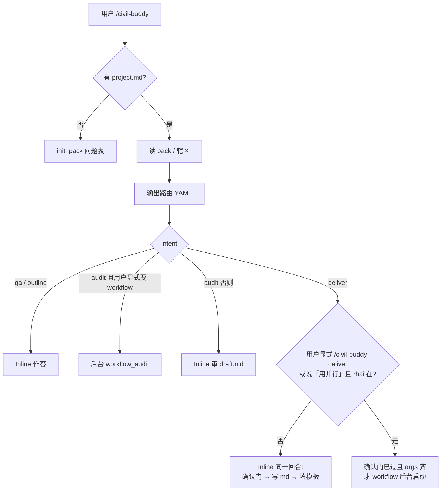
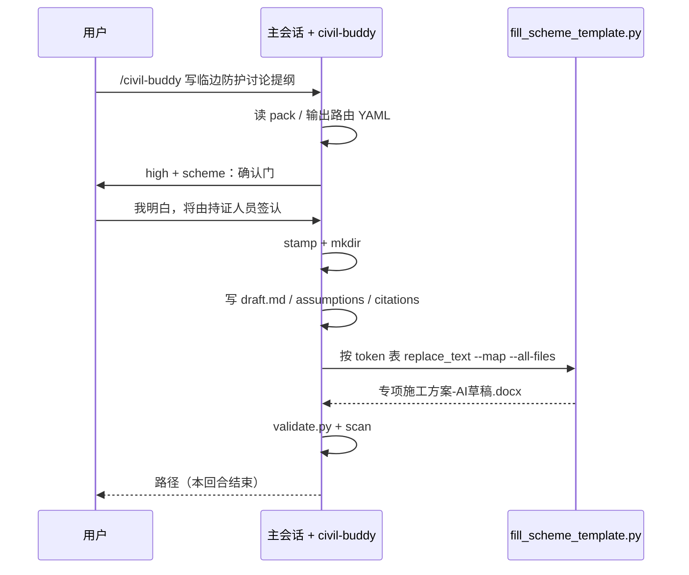
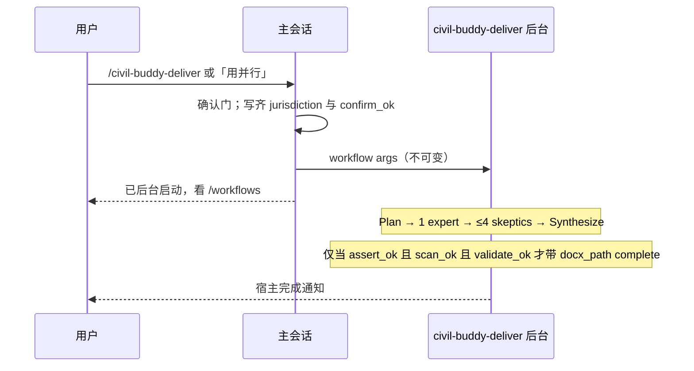

# Civil Buddy：Grok 原生土木工作搭子设计说明

| 字段 | 值 |
|------|-----|
| 文档标题 | Civil Buddy（Grok-native civil work agent） |
| 作者 | TBD（Grok design-doc-writer） |
| 日期 | 2026-08-13 |
| 状态 | Approved for implementation (user 2026-08-13) |
| 产品代号 | `civil-buddy` |
| 斜杠命令 | `/civil-buddy` |
| 实现宿主 | 用户级 Grok Build，**不是**当前工作区 `C:\Users\LW\Saved Games` |
| 产品仓库 | `C:\Users\LW\civil-buddy`（独立 git repo；本文批准后由实施 PR-1 创建） |
| 对标 | 腾讯 WorkBuddy 的「下指令 → 多专家并行 → 交出成品」行为，**不是**其桌面 OS 控制产品 |
| 切片含义 | 下文「PR」= 该仓库内可独立审查的提交。Workflow 源在仓库，启用时再复制到 `C:\Users\LW\.grok\workflows\`（PR-3）。 |

---

## Overview

用户要用自然语言起草土木文件（专项方案**讨论提纲**、计算书提纲、交底草稿、检查表、资料闭合、交通报告），而不是在聊天里反复讨论文字。腾讯 WorkBuddy（[workbuddy.ai](https://www.workbuddy.ai/)、[copilot.tencent.com/work](https://copilot.tencent.com/work/)；官网桌面/IM 细节以外部营销页为准，本修订未再爬活站）把「专家并行、出 Word/PPT」做成桌面工作台。本产品做同一类**起草**，但落在 **Grok Build TUI**：一个用户级 skill 负责路由与硬规则；可选 Rhai workflow 做多专家并行与对抗复核；成品优先 **填充已入库的 A4 宋体 `.docx` 模板**（bundled `docx` 的 `editing.md`：`unpack.py` → `replace_text.py --map --all-files` → `pack.py`），而不是每轮重写 docx-js，也不是把整份 Markdown 灌进一个 `{{BODY}}`。项目上下文用作业目录 `.civil-buddy/project.md` 跨会话复用。

**V1 法定口径：** 产出是「内部讨论用 AI 草稿」，**不是**住建部令第 37 号意义上的法定专项施工方案，也不是可送专家论证、监理审核或据以开工的文本。禁止**断言式**用语（「可交差 / 可提交专家论证 / 请监理审核后开工 / 可以开工 / 报审通过」）。封面固定声明里出现「专家论证」「开工」作为**否定句宾语**是合法且必需的，扫描器必须放行。

**启动规则：** V1 **全程 inline**——主会话同一回合写 `draft.md` 并按占位符表填模板出 docx。`workflow()` 是后台启动，返回值 **不是** `complete()`。Workflow **只**在用户显式 `/civil-buddy-deliver` 或说「用并行」且 `.rhai` 在盘时启动。**从不自动改道。** 不存在「握手已测通」开关。`.rhai` 在磁盘上存在 ≠ 必须调用它。

本机已核实：`C:\Users\LW\.grok\skills` **不存在**；`C:\Users\LW\civil-buddy` 产品仓库由实施阶段创建（本文不建）。可复用：bundled `docx` / `pptx` / `pdf`、`create-skill` / `create-workflow` / `skill-design-principles`，以及 `C:\Users\LW\.grok\workflows\teams-requirements-audit.rhai`。**没有** bundled `xlsx` skill。`09-plugins.md` 的 plugin 内容是 skills / commands / agents / hooks / MCP / LSP，**不含** workflow。`replace_text.py` 与 `unpack.py` **不在同一目录**。`convert_doc.py` 在 `docx\scripts\`，`soffice.py` 在 `docx\scripts\office\`。当前工作区 `Saved Games` 不是产品仓库。**V1 不接 MCP**；V2 接只读 MCP（规范库 / 图纸管理），见 §11。

---

## Background & Motivation

### WorkBuddy 实际卖什么（必须诚实映射）

公开页定位是 *“not just answers — finished work”*：自然语言下任务，专家并行，交出 `.md` / `.docx` / `.pptx`，并宣传接 IM / 办公套件与桌面操作。桌面键鼠与 IM 是另一类产品。

本产品只映射其中 **可在 Grok 内兑现** 的几条：

| WorkBuddy 能力 | 本产品对应 | 不对应 |
|----------------|------------|--------|
| 自然语言下任务 | `/civil-buddy` + `description` / `when-to-use` | 桌面常驻托盘 |
| 多专家并行 | workflow `parallel()` + skill 内专家路由 | 100+ 通用办公专家市场 |
| Skills / MCP 扩展 | 用户 skill；office 走 bundled skills | 克隆其 Expert Center |
| 交出成品文档 | 入库模板按 token 填 `docx`；后续 pptx / md；xlsx **晚于** spreadsheet 路径 | 接管 Word/WPS 桌面 |
| 接 IM / 办公套件 | **非目标** | 微信、飞书、企微、腾讯文档 |
| 桌面键鼠控制 | **非目标** | 沙箱里点图标 |

口号可以借用「不是聊天，是把草稿写完」——但不能暗示用户装了 WorkBuddy，也不能暗示草稿等于法定方案。

### 本机现状与痛点

1. **没有土木 skill。** 产品仓库 `C:\Users\LW\civil-buddy` 尚未创建。每次都要重讲规范体系、禁止编造、要出文件。
2. **Office 管道已在，未接到土木工序。**
   - `C:\Users\LW\.grok\bundled\skills\docx\SKILL.md`（`user-invocable: false`；**docx-js 默认纸张是 A4**；有模板时必须走 `editing.md`）
   - `C:\Users\LW\.grok\bundled\skills\docx\editing.md`：`unpack.py` → `replace_text.py` / `replace_field.py` → `pack.py`；只做**字符串**替换，不能增行、不能把 Markdown 变成 Word 标题
   - `C:\Users\LW\.grok\bundled\skills\pptx\SKILL.md`
   - `C:\Users\LW\.grok\bundled\skills\pdf\SKILL.md`（pypdf / pdfplumber / reportlab / OCR；**不是** `soffice.py` 的家）
   - **没有** `xlsx` skill
3. **并行+skeptic 范例已在。** `teams-requirements-audit.rhai` 第 46 行默认 `root = D:/layout`。Civil Buddy **禁止**复制这个默认。
4. **用户作业已是双辖区。** `D:\layout` 为新加坡 Tuas South Ave 5 / Line-5；会话里同时有国内施工话语。
5. **Memory 默认关**（`13-memory.md`；本机 `config.toml` 无 `[memory]`）。项目概况必须落盘。

### 性能目标（拆开，不作 SLA）

| 路径 | 目标 | 不是 |
|------|------|------|
| V1 inline scheme | **一回合**写完 `draft.md` + 填模板 docx + 扫描。不承诺分钟数。 | 「一次命令 8–20 分钟」 |
| Workflow（仅显式启动） | 用户在 `/workflows` 看阶段；`complete()` 之后文件已在 `args.out_dir`。主会话 **不等待** `workflow()` 返回值。 | 同步 RPC |
| V1.1 扇出上限 | **1 expert + ≤4 skeptics** + 1 plan + 1 synth | 一上来 4×8 |

成品体积（经验）：docx 80–400 KB；嵌入照片长边 ≤1600 px，整包 < 15 MB。

---

## Goals & Non-Goals

### Goals

1. 在 Grok TUI 用 `/civil-buddy` 或自然语言（「写专项方案草稿 / 出计算书提纲 / 做交底草稿 / 组检查表 / 回监理通知草稿」）进入统一入口。
2. 六类专家在 **一个 skill 内路由**；并行是可选 workflow，不是六个 slash 命令。
3. 双辖区一等公民：`CN`（GB / GB/T / JTG / JGJ / JTS / CJJ 等）与 `SG` / `EU`（SS EN、BCA、LTA、EC2/EC3 等）。切换必须显式。禁止静默混用。
4. 硬专业规则可执行：不编条款号、材料强度、岩土参数、综合单价；有来源的计算才写「公式 → 代入 → 结果 → 单位」；否则 `[Axxx]` + 「待填」，**不准编验算结论**。
5. 交付物是磁盘上的真实文件。V1：`md` + 模板填充的 `docx`。`pptx` / `pdf` 水印 / `xlsx` 分后期切片。用户可转发的是 **草稿**，不是报审件。
6. 项目上下文用 `.civil-buddy/project.md`，不依赖 Grok Memory。
7. **V1（= PR-2，不是 PR-1）** 即给出可打开的 `专项施工方案-AI草稿.docx`：虚构临时 project pack + 提示词。封面与页眉写明内部讨论草稿。
8. 遵守 `create-skill` / `create-workflow` / `skill-design-principles`：事实单点存放；skill 正文是给模型的编号工序。

### Non-Goals（诚实边界）

- **不是** WorkBuddy / CodeBuddy 桌面客户端，不控制鼠标键盘。
- **不是** Rhino / Civil 3D / Revit / OpenRoads / VISSIM / Synchro 插件。`D:\layout` 的 `.3dm` 只读，不改模型。
- **不接** 微信、企微、飞书、钉钉、腾讯文档、Slack。
- **不假装** 注册结构/岩土/监理工程师或 Singapore PE / QP / RTO。
- **不产出法定专项施工方案、交底签认件、专家论证件、监理审核件、开工依据。** 禁止**断言**「已具备报审条件 / 可提交专家论证 / 请监理审核后开工 / 可以开工」。封面用否定句说明「不构成……专家论证材料或开工依据」是要求，不是违规。
- **不把整本规范塞进 skill。**
- **不做法条 RAG**（V1–V2）。
- **不做** 独立 Web/桌面安装包。
- **不新增** bundled skill，不覆盖 `docx`/`pptx`/`pdf`。
- **不把** `C:\Users\LW\Saved Games` 当成产品仓库。
- **不把** `.rhai` 打进 plugin（宿主不支持）。
- **V1 不做 Markdown→Word 样式转换。** 标题样式来自模板里已排好的 Heading，脚本只换 token。
- **V1 验收不写 `D:\layout`。** SG 中英对照是 V2。

---

## Proposed Design

### 1. 宿主、范围与命名

按 `C:\Users\LW\.grok\docs\user-guide\08-skills.md` 与 `C:\Users\LW\.grok\bundled\skills\create-skill\SKILL.md`。用户已定：**独立 git 仓库**，不是只写 `~\.grok\skills`。

| 项 | 决定 |
|----|------|
| 名称 | `civil-buddy` |
| 产品仓库 | `C:\Users\LW\civil-buddy`（standalone git；plugin 形：根下 `skills/`） |
| Skill 路径 | `C:\Users\LW\civil-buddy\skills\civil-buddy\SKILL.md` |
| 发现 | 在 `C:\Users\LW\.grok\config.toml` **只追加**下面 `[skills]` 片段（**禁止**整文件重写）。`grok inspect` 来源为 `config`。 |
| 调用 | `/civil-buddy`；`/skills civil-buddy`；`description` / `when-to-use` 自动触发 |
| 若撞名 | 内置命令占裸名；`[skills].paths` 技能可用合格名。当前无撞名。 |
| Workflow 源 | 仓库 `C:\Users\LW\civil-buddy\workflows\*.rhai` |
| Workflow 启用 | PR-3 起**复制**到 `C:\Users\LW\.grok\workflows\`（宿主只扫该处与作业 `.grok/workflows/`；plugin 不装 rhai） |
| 作者规范 | 写 skill 前读 `skill-design-principles`；写 workflow 前读 `create-workflow` 全文 |

**发现片段（实施者或用户手工合并进现有 `config.toml`，不要覆盖其它段）：**

```toml
[skills]
paths = ["C:/Users/LW/civil-buddy/skills"]
```

等价备选（二选一即可，推荐上一行，便于日后同仓库再放其它 skill）：

```toml
[skills]
paths = ["C:/Users/LW/civil-buddy/skills/civil-buddy"]
```

`08-skills.md`：`paths` 可以是 `SKILL.md` 或目录，Grok 会递归走。`~` 展开可用，本机用正斜杠绝对路径以免 PowerShell 歧义。

若用户 `config.toml` **已有** `[skills]` 表，只把该路径 **append** 进已有 `paths` 数组，不得删掉别人的 `ignore` / `disabled`。

### 2. 目录布局

```
C:\Users\LW\civil-buddy\                 # 产品 git 根（plugin 形）
  README.md
  plugin.json                            # PR-8 再写；V1 可空缺
  skills\
    civil-buddy\
      SKILL.md
      references\
        hard-rules.md
        jurisdictions.md
        citation-format.md
        project-pack.md
        deliverable-pipeline.md
        experts\
          construction.md
          structural-geotech.md
          municipal.md
          cost.md
          supervision.md
          traffic.md
        templates\
          scheme-outline.md
          calc-outline.md
          briefing-outline.md
          checklist-outline.md
          scheme-cn-a4.docx
      scripts\
        fill_scheme_template.py
        scan_forbidden_inventions.py
        verify_clause.py
        assert_outdir_only.py
        validate_project_pack.py
      examples\
        sample-cn-project.md
  workflows\                             # 源；PR-3 复制到 ~/.grok/workflows/
    civil-buddy-deliver.rhai
    civil-buddy-audit.rhai

C:\Users\LW\.grok\workflows\             # 宿主加载处（PR-3 起）
  teams-requirements-audit.rhai          # 已存在，勿改
  civil-buddy-deliver.rhai               # 自仓库复制
  civil-buddy-audit.rhai
```

作业目录项目包（**不属于** skill）：

```
<job>/.civil-buddy/
  project.md
  codes.md
  sources/
  out/<stamp>/
    draft.md
    assumptions.md
    citations.md
    replacements.json          # fill 脚本写出的 token 表，便于审计
    manifest.json
    专项施工方案-AI草稿.docx
```

硬规则只住在 `references/hard-rules.md`。

### 3. Skill 前端、触发与 SKILL.md 编号工序

Frontmatter（kebab-case，按 08-skills）：

```markdown
---
name: civil-buddy
description: >
  土木/施工/结构/岩土/市政/造价/监理/交通工程的起草搭子。
  写出内部讨论用 AI 草稿：专项方案讨论提纲、计算书提纲、交底草稿、
  检查表、资料目录、监理回复草稿。不得当作法定专项方案或签认件。
  Use when the user runs /civil-buddy, or asks for 专项方案, 施工方案,
  技术交底, 安全交底, 计算书, 荷载组合, 旁站, 质量检查, 管线综合,
  工程量清单, 变更签证, 验收资料, 监理通知, VISSIM, 交通组织,
  GB/T, JGJ, JTG, SS EN, Eurocode, BCA, LTA, or a civil/construction
  Word/PPT/PDF draft.
argument-hint: 任务（如：按 project pack 写临边防护方案讨论提纲）
user-invocable: true
when-to-use: >
  用户要土木草稿文档、规范核对、交底/检查表、双辖区切换，
  或说 WorkBuddy/工作搭子且场景是土木。
metadata:
  short-description: Civil engineering draft agent (not statutory filings)
  author: user
---
```

#### 3.1 `SKILL.md` 正文必须按下列编号步骤写

**Step 0 — 读规则（每次）**

1. `read_file` `references/hard-rules.md`、`jurisdictions.md`、`citation-format.md`。
2. 禁止把这三份全文再抄进 expert 文件。

**Step 1 — 定位作业根与 pack**

1. 发现顺序：用户点名的 pack → `<cwd>/.civil-buddy/project.md` → 向上最多 4 层 → 都没有则 `intent=init_pack`。
2. **禁止**把 `D:\layout` 当作缺省 root。
3. `init_pack` 只问下面清单，问完再写 pack，不得边问边编工程。

`init_pack` 问题（一次问完，允许空的标「暂缺」）：

| 优先级 | 字段 | 说明 |
|--------|------|------|
| 必填 | `jurisdiction` | `CN` / `SG` / `EU` / `DUAL` |
| 必填 | `name` | 工程名称（可虚构） |
| 必填 | `unit_works` | 至少一个单位工程 id+名称 |
| 建议 | `site_location` | 可空 |
| 建议 | `code_family_primary` | 缺则按辖区填族名，不含条款 |
| 建议 | `language` | 缺省 `zh-CN`。V1 只出中文 |
| 可后补 | `client` / `contractor` / `designer` | 空字符串合法 |
| 固定 | `confidential` | 缺省 `true` |
| 固定 | `status` | `draft` |

**Step 2 — 路由块（动手前必须先输出）**

```yaml
intent: qa | outline | deliver | audit | init_pack
jurisdiction: CN | SG | EU | DUAL
experts: [construction]
deliverable: scheme | calc | briefing | checklist | supervision | traffic_report | slides
risk: low | high
mode: inline | workflow_deliver | workflow_audit
confirm_gate: pending | accepted | not_required
```

**Step 3 — 风险与确认门**

- `deliverable=scheme` **永远** `high`。
- 下列任一出现 → `high`：临边、洞口、高处作业、脚手架、模板/支撑、起重、有限空间、深基坑、结构验算、验收结论、交通导改。
- `high` 且 `intent=deliver`：写盘前必须让用户打出确认句（见 §10）。未确认 → 停。`confirm_gate` 保持 `pending`。
- **禁止断言**「可交差 / 可提交专家论证 / 请专家论证 / 请监理审核后开工 / 可以开工 / 报审通过」。§10 固定声明与页眉库存句不在禁止之列。

**Step 4 — 选 mode（无「握手已测通」谓词）**

| 条件 | mode |
|------|------|
| `qa` / `outline` / `init_pack` | `inline` |
| `deliver` 且用户**没有**说「用并行」且**没有**跑 `/civil-buddy-deliver` | **`inline`**（唯一自动路径，与 `.rhai` 是否存在无关） |
| 用户显式 `/civil-buddy-deliver` 或说「用并行」，且 `civil-buddy-deliver.rhai` 在盘 | `workflow_deliver` |
| `audit` 且用户显式要求 audit workflow，且 `civil-buddy-audit.rhai` 在盘 | `workflow_audit`；只审 `draft.md` |
| 要走 workflow 但 `.rhai` 不存在 | 降级 `inline`，并说明 |

**从不**因 `high` / `scheme` / 「`.rhai` 在盘」自动改道。

**Step 5 — inline deliver（V1 主路径，同一回合）**

1. 主会话用本机时钟生成 `stamp`（`yyyy-MM-ddTHH-mm-ss`，本地时区）。Rhai **不得**做这件事。
2. PowerShell：`New-Item -ItemType Directory -Force -Path "<job>\.civil-buddy\out\<stamp>"`。
3. 读 `references/experts/<id>.md` 与 `templates/scheme-outline.md`。
4. 写 `draft.md`（11 章纯文本段落，见 §7.2）/ `assumptions.md` / `citations.md`。数字无来源 → `[Axxx]` + 待填。
5. 调 `fill_scheme_template.py`（§7.1 CLI）。**禁止** docx-js；**禁止**把整份 md 塞进一个 `{{BODY}}`。
6. 跑 `validate.py`、`scan_forbidden_inventions.py`。任一个非 0 → 不得向用户报成功。
7. 写 `manifest.json`：仅列入已存在文件；无 docx 则省略 `files.docx` 且 `docx_pending: true`。

**Step 6 — workflow_deliver（仅显式启动）**

1. 主会话做完 Step 3 确认门。未确认 **不得** 调用 `workflow()`。
2. 生成 `stamp` 与绝对 `out_dir`（正斜杠），`mkdir`。
3. 调用 `workflow` 工具时 `args` **必须**已含：`root`、`task`、`jurisdiction`、`out_dir`、`confirm_ok: true`。缺任一项就不要启动。
4. 工具返回只表示后台 run 已挂上。对用户说看 `/workflows`。不要轮询。不要把 tool result 当 `manifest`。
5. 成品由同一条脚本的 Synthesize 写到 `out_dir`。主会话此回合结束。

**Step 7 — 停止条件**

- 无辖区；`scheme` 未过确认门；用户要组价但无清单/定额/询价；用户要法定签认件/报审件；`validate.py` ≠ 0；扫描器 ≠ 0。

**inline skeptic（无独立子 agent）：** 写盘前自检编制依据双表、正文条款号是否都在 `citations.md`、有无断言式禁语。

### 4. 路由器



用户显式启动示例（主会话已写入全部不可变 args）：

```text
/civil-buddy-deliver {"root":"C:/Temp/civil-buddy-v1/job","task":"...","jurisdiction":"CN","confirm_ok":true,"experts":["construction"],"deliverable":"scheme","stamp":"2026-08-13T15-04-05","out_dir":"C:/Temp/civil-buddy-v1/job/.civil-buddy/out/2026-08-13T15-04-05"}
```

Host 约束（不得发明）：

- `name` / `script` / `script_path` 三选一。
- **不能**再启动另一个 workflow。
- 用户脚本 **不能** `fork_context`。
- `args` 在 resume 时**不可变**。`await_user` 不能把用户的话写进 `args.jurisdiction` / `args.confirm_ok`。
- 缺 `root` / `out_dir` / `jurisdiction` / `confirm_ok==true` → `pause("verification", ...)`，**不要** `await_user`。
- Rhai **没有** `timestamp()` / `sleep()`。
- `workflow()` 返回 ≠ `complete()`。

### 5. 六类专家

专家 = `references/experts/<id>.md`。**id、文件名、路由字段同一套连字符拼写**，禁止 `structural_geotech`。

Persona **不可**从 `spawn_subagent` / `agent()` 选取。workflow 子 agent 必须在 prompt 里写入该 md 的**路径**并命令 `read_file`。

| id | 中文 | 典型产出 | 默认格式 |
|----|------|----------|----------|
| `construction` | 施工 | 方案讨论提纲、交底草稿、旁站要点、质量检查表骨架 | V1：md + 模板 docx |
| `structural-geotech` | 结构/岩土 | 计算书提纲、荷载组合表头、复核清单 | md |
| `municipal` | 市政/道路 | 管线综合原则、横断说明、排水、交通组织 | md |
| `cost` | 造价 | 工程量拆分、组价说明空表、签证口径 | **仅 md**，直到 PR-6c |
| `supervision` | 资料/监理 | 验收资料目录、闭合检查、监理通知回复草稿 | **仅 md**，直到 PR-6c |
| `traffic` | 交通土木 | 仿真实验设计、报告结构、图表口径 | md |

每个 expert 文件四段：何时上场 / 必问输入 / 章节骨架指针 / 本专业额外禁令。

#### 5.1 `construction.md`（V1 必须写满）

**何时上场：** 专项方案、施工方案、技术/安全交底、旁站、质量检查、临边、洞口、脚手架、模板、基坑、起重。

**必问输入（缺则停或标 ASSUMPTION，不准默填）：**

1. 辖区（来自 pack 或本轮覆盖）
2. 单位工程 id
3. 作业部位（哪条边、哪个洞口、哪层）
4. 高度或临边长度的**来源**（pack / 用户 / 图纸文件名）。无来源 → 不写毫米级尺寸
5. 用户图号清单（可空 = 正文禁止「见图 x.x」）

**额外禁令：**

- 不得默写 JGJ 80 栏杆高度、栏杆水平荷载、踢脚板高度。
- 不得给出「经验算满足」而无用户/PDF 数字。需要数字时写 `[Axxx] 待填`。
- 不得把讨论提纲称作专项方案报审稿。
- 不得写断言式禁语（§7.3）。

**V1 只把 `construction` 写满。** 其余五个文件各 < 40 行骨架，但 id 必须全部可路由。

### 6. Workflows

#### 6.0 何时出 docx / 何时启动（无握手旗标）

| 阶段 | 谁出 docx | 何时启动 workflow |
|------|-----------|-------------------|
| V1 / PR-2 | 主会话同一回合 `fill_scheme_template.py` | **不启动** |
| PR-3 起 | 同一条 `civil-buddy-deliver` 的 Synthesize（`all`）调同一脚本 | **仅** `/civil-buddy-deliver` 或用户说「用并行」 |
| 任何时候 | 禁止 workflow 再 `workflow()` | 从不因 `high` 自动启动 |

PR-3 说明里由实施者人工记一次本机 `complete()` 成功即可，**不要**做成运行时旗标。

#### 6.1 范型

照抄 `teams-requirements-audit.rhai` 的控制流：纯字面量 `meta` → 带引号的 JSON Schema → 守卫 `args` → `parallel` → 封顶嫌疑 → 对抗验证 → Synthesize → 按 schema 布尔分支 `complete`。用 `json_encode` 传不可信中间量。`r != () && r.success && r.output != ()`。

**不要**抄 `root = D:/layout`。**不要**抄字段名 `real`。

#### 6.2 `civil-buddy-deliver`

**文件：** `C:\Users\LW\.grok\workflows\civil-buddy-deliver.rhai`

| Phase | 做什么 | Agent 数（V1.1） | capability_mode |
|-------|--------|------------------|-----------------|
| Plan | 确认专家子集、缺失输入、大纲 | 1 | `read-only` |
| Experts | 读 pack / sources | **1** | `read-only` |
| Verify | 打发明 / 混辖区 / 裸数字 | **≤4** | `read-only` |
| Synthesize | 重读 `hard-rules.md`；按 Rhai 已分配 A 号写 md；调 fill + scan + validate + assert | 1 | `all` |

`agent_budget` 显式调用建议 `16`。

**`args` 契约（缺则 `pause("verification")`，不用 `await_user`）：**

```text
root            必填
task            必填
jurisdiction    必填（CN|SG|EU|DUAL）
confirm_ok      必填且必须为 true
out_dir         必填绝对路径（正斜杠）。禁止默认 out/deliver
stamp           建议传入；脚本不调用 timestamp()
experts         可选；脚本白名单过滤
deliverable     缺省 scheme
project_pack    可选；默认 root + "/.civil-buddy/project.md"
code_pdfs       可选 string[]
```

主会话未备齐上述字段就 **不得** 调用 `workflow()`。脚本里若仍缺或 `confirm_ok != true` → `pause("verification", "pass confirm_ok=true and jurisdiction")`。

**路径规范化：** 把 `root` / `out_dir` 的 `\` 换成 `/`。`out_dir` 必须以 `root + "/.civil-buddy/out/"` 开头，否则 `pause`。

**专家白名单：** `construction | structural-geotech | municipal | cost | supervision | traffic`。白名单外 drop + `log`。

**Planner schema（PR-3 必须按此粘贴进 `.rhai`）：**

```rhai
let plan_schema = #{
    "type": "object",
    "required": ["jurisdiction", "experts", "deliverable", "outline", "missing_inputs", "risk"],
    "properties": #{
        "jurisdiction": #{ "type": "string" },
        "experts": #{ "type": "array", "maxItems": 4, "items": #{ "type": "string" } },
        "deliverable": #{ "type": "string" },
        "outline": #{ "type": "array", "maxItems": 20, "items": #{ "type": "string" } },
        "missing_inputs": #{ "type": "array", "maxItems": 12, "items": #{ "type": "string" } },
        "risk": #{ "type": "string" },
        "stop_reason": #{ "type": "string" },
    },
};
```

Planner 输出的 `jurisdiction` **不得覆盖** `args.jurisdiction`。`experts[]` 必须是连字符 id。

**Expert schema：**

```rhai
let expert_schema = #{
    "type": "object",
    "required": ["expert", "sections", "citations", "assumptions", "inventions_refused"],
    "properties": #{
        "expert": #{ "type": "string" },
        "sections": #{
            "type": "array", "maxItems": 16,
            "items": #{
                "type": "object",
                "required": ["heading", "body_md"],
                "properties": #{
                    "heading": #{ "type": "string" },
                    "body_md": #{ "type": "string" },
                },
            },
        },
        "citations": #{
            "type": "array", "maxItems": 20,
            "items": #{
                "type": "object",
                "required": ["family", "full_name", "year", "clause", "confidence"],
                "properties": #{
                    "family": #{ "type": "string" },
                    "full_name": #{ "type": "string" },
                    "year": #{ "type": "string" },
                    "clause": #{ "type": "string" },
                    "confidence": #{ "type": "string" },
                    "source_pdf": #{ "type": "string" },
                },
            },
        },
        "assumptions": #{
            "type": "array", "maxItems": 16,
            "items": #{
                "type": "object",
                "required": ["id", "text", "owner"],
                "properties": #{
                    "id": #{ "type": "string" },
                    "text": #{ "type": "string" },
                    "owner": #{ "type": "string" },
                },
            },
        },
        "inventions_refused": #{ "type": "array", "maxItems": 12, "items": #{ "type": "string" } },
        "warnings": #{ "type": "array", "maxItems": 12, "items": #{ "type": "string" } },
    },
};
```

Expert 的 `assumptions[].id` 是临时号。Rhai 按 `experts` 数组顺序、再按该 expert 的 `assumptions` 顺序重编号为 `A001`、`A002`…，然后 `json_encode` 交给 Synthesize。禁止专家自报最终号。

**Skeptic schema：**

```rhai
let verify_schema = #{
    "type": "object",
    "required": ["accusation_stands", "reason", "evidence"],
    "properties": #{
        "accusation_stands": #{ "type": "boolean" },
        "reason": #{ "type": "string" },
        "evidence": #{ "type": "string" },
    },
};
```

`accusation_stands=true`：指控成立，必须降级。槽位 `()` / 失败 / 空 evidence → 相关引用不得进已核实表。

**Synthesize schema（机械门闩；prompt 不算数）：**

```rhai
let synth_schema = #{
    "type": "object",
    "required": ["assert_ok", "scan_ok", "validate_ok", "docx_path", "draft_path", "manifest_path"],
    "properties": #{
        "assert_ok": #{ "type": "boolean" },
        "scan_ok": #{ "type": "boolean" },
        "validate_ok": #{ "type": "boolean" },
        "docx_path": #{ "type": "string" },
        "draft_path": #{ "type": "string" },
        "manifest_path": #{ "type": "string" },
        "assumption_count": #{ "type": "number" },
        "citations_verified": #{ "type": "number" },
        "citations_unverified": #{ "type": "number" },
        "summary": #{ "type": "string" },
    },
};
```

Rhai 在 Synthesize 返回后：

```text
ok = r != () && r.success && r.output != ()
     && r.output.assert_ok == true
     && r.output.scan_ok == true
     && r.output.validate_ok == true
     && r.output.docx_path != () && r.output.docx_path != ""
if !ok:
    complete(#{ rejected: true, summary: "...", docx_path: () })
else:
    complete(#{ rejected: false, ... 含 docx_path })
```

**引用 fail-closed：** 模型自报 `verified` 不算。`verify_clause.py` 抽词成功才进已核实表。扫描件无 OCR → `unspecified_clause`。已核实表有行但 `citations_verified==0` → `rejected: true`。`confidential: true` 禁止 `web_search`。

**写盘允许列表：** 仅 `out_dir` 下 `draft.md` `assumptions.md` `citations.md` `replacements.json` `manifest.json` `专项施工方案-AI草稿.docx`。`assert_outdir_only.py` 的退出码必须映射到 `assert_ok`。

**11 章主笔（V1 仅 construction 时，缺席行填「待填」）：**

| # | 章节 | token | 主笔 |
|---|------|-------|------|
| 1 | 封面与文件控制 | `{{PROJECT_NAME}}` `{{STAMP}}` `{{JURISDICTION}}` `{{SHORT_NAME}}` | Synthesize / fill 脚本从 pack 灌 |
| 2 | 草稿与责任声明 | 无（模板固定 §10 全文） | 模板检入时写死 |
| 3 | 工程概况 | `{{SEC_OVERVIEW}}` | `construction`（只引 pack） |
| 4 | 编制依据 | `{{CITED_VERIFIED}}` `{{CITED_UNVERIFIED}}` | Synthesize 预渲染纯文本 |
| 5 | 施工部署与工艺 | `{{SEC_DEPLOY}}` | `construction` |
| 6 | 质量 | `{{SEC_QUALITY}}` | `construction` |
| 7 | 安全与应急 | `{{SEC_SAFETY}}` | `construction`；`structural-geotech` 只许附录 |
| 8 | 环保与文明施工 | `{{SEC_ENV}}` | `construction` |
| 9 | 资源计划 | `{{SEC_RESOURCES}}` | `cost` 若在场，否则 construction 表头待填 |
| 10 | 验收与资料 | `{{SEC_ACCEPTANCE}}` | `supervision` 若在场，否则目录骨架 |
| 11 | 附录 | `{{SEC_APPENDIX}}` | `structural-geotech`；无则 `[Axxx] 待填`，禁止验算结论 |

封面后、第 3 章前：`{{ASSUMPTIONS}}`（预渲染纯文本，不是动态表 XML）。

冲突：非主笔不得覆盖主笔章节 token。

#### 6.3 `civil-buddy-audit`（PR-5）

只审 `draft.md`。用户只给 docx 时，主会话先：

`pandoc --track-changes=all file.docx -o draft.md`

五维：`jurisdiction_purity` / `citation_integrity` / `no_invented_numbers` / `calc_trace` / `liability_banner`。Skeptic 用 `accusation_stands`。

#### 6.4 时序

**V1 inline：**



**Workflow（仅显式；args 启动前已齐）：**



### 7. 交付物管道

权威说明：`references/deliverable-pipeline.md`。

| `deliverable` | 做什么 | 不做 |
|---------------|--------|------|
| `scheme` | 复制 `scheme-cn-a4.docx`，按 §7.1 填 token | docx-js；Markdown→docx；改表 XML；单 `{{BODY}}` |
| 无模板例外 | 仅模板文件缺失时才走 docx-js；**默认 A4** 11906×16838 DXA | 抄 skill 示例的 US Letter |
| `slides` | PR-6a：pptx skill + `search_templates.py` | python-pptx 新建 |
| `pdf` 水印 | PR-6b：见下方**两条不同路径** | 说 convert_doc 与 soffice 同目录 |
| `checklist` / `cost` | PR-6c 前只出 md | 假装有 `/xlsx` |

PDF 两条路径（不是同一文件夹）：

```text
C:\Users\LW\.grok\bundled\skills\docx\scripts\office\soffice.py --headless --convert-to pdf <docx>
C:\Users\LW\.grok\bundled\skills\docx\scripts\convert_doc.py <docx> --to pdf
```

水印用 pdf skill 的 pypdf `merge_page`。

#### 7.1 `fill_scheme_template.py`（PR-2 合同）

**CLI（实现必须认这些开关，不得再发明一套）：**

```text
python C:\Users\LW\civil-buddy\skills\civil-buddy\scripts\fill_scheme_template.py
  --template C:\Users\LW\civil-buddy\skills\civil-buddy\references\templates\scheme-cn-a4.docx
  --draft      <out_dir>/draft.md
  --assumptions <out_dir>/assumptions.md
  --citations  <out_dir>/citations.md
  --jurisdiction CN
  --stamp      2026-08-13T15-04-05
  --project-name "示例工程"
  --short-name "示例"
  --out        <out_dir>/专项施工方案-AI草稿.docx
```

脚本步骤（只做字符串替换）：

1. 把 11 章与三张预渲染块从 md **抽成纯文本**（去掉 `#` 标记即可；**不**映射 Word Heading）。
2. 写 `out_dir/replacements.json`，键必须是下表 token **含花括号**（与模板正文逐字相同，`replace_text.py` 按字面匹配）。
3. 复制模板到工作副本。
4. 调用 bundled 工具，**绝对路径如下，分属两个目录**：

```text
python C:\Users\LW\.grok\bundled\skills\docx\scripts\office\unpack.py <work.docx> <unpacked>/
python C:\Users\LW\.grok\bundled\skills\docx\scripts\replace_text.py <unpacked>/ --map <out_dir>/replacements.json --all-files
python C:\Users\LW\.grok\bundled\skills\docx\scripts\office\pack.py <unpacked>/ <out.docx> --original <work.docx>
python C:\Users\LW\.grok\bundled\skills\docx\scripts\office\validate.py <out.docx>
```

`--all-files` 必开，否则页脚 `{{JURISDICTION}}` 不会被换。  
**禁止**改 XML、禁止增表行、禁止 markdown-to-docx。Word 样式 = 模板里已经排好的标题/表/页眉。

**完整 token 表（模板与 `replacements.json` 必须同时有这些键；值为预渲染纯文本）：**

| token | 来源 | 说明 |
|-------|------|------|
| `{{PROJECT_NAME}}` | `--project-name` / pack `name` | 封面 |
| `{{SHORT_NAME}}` | `--short-name` / pack `short_name` | 页眉 |
| `{{STAMP}}` | `--stamp` | 封面 |
| `{{JURISDICTION}}` | `--jurisdiction` | 封面+页脚（靠 `--all-files`） |
| `{{ASSUMPTIONS}}` | `assumptions.md` 预渲染 | 封面后独立块；纯文本，不是表 XML |
| `{{SEC_OVERVIEW}}` | draft 第 3 章 | 工程概况 |
| `{{CITED_VERIFIED}}` | citations 已核实行预渲染 | 无行则字面「（无）」 |
| `{{CITED_UNVERIFIED}}` | citations 未核/UNSPECIFIED 预渲染 | 至少保留表头文字 |
| `{{SEC_DEPLOY}}` | draft 第 5 章 | 施工部署与工艺 |
| `{{SEC_QUALITY}}` | draft 第 6 章 | 质量 |
| `{{SEC_SAFETY}}` | draft 第 7 章 | 安全与应急 |
| `{{SEC_ENV}}` | draft 第 8 章 | 环保 |
| `{{SEC_RESOURCES}}` | draft 第 9 章 | 资源 |
| `{{SEC_ACCEPTANCE}}` | draft 第 10 章 | 验收与资料 |
| `{{SEC_APPENDIX}}` | draft 第 11 章 | 附录 |

模板内 **写死、不进入 replacements.json** 的库存句（扫描器 allowlist）：

- 页眉：「AI 草稿 · 内部讨论 · 不得作为法定专项方案 / 交底签认件」
- 第 2 章全文 = §10 固定声明（一字不改）
- 签认栏「编制 / 审核 / 批准」空行

预渲染示例（`{{CITED_UNVERIFIED}}`，纯文本，用换行不用 Markdown 表）：

```text
全名 | 年份 | 条款 | 状态
建筑施工高处作业安全技术规范 | UNAVAILABLE | UNSPECIFIED | unverified
```

#### 7.2 `scheme-outline.md`：11 章（不可删）

标题统一：「专项施工方案讨论提纲（AI 草稿）」。不可写「报审稿」。

1. 封面与文件控制（版本；编制/审核/批准空栏；`{{PROJECT_NAME}}` / `{{STAMP}}` / `{{JURISDICTION}}`）
2. 草稿与责任声明（模板固定 §10，脚本不替换）
3. 工程概况（只引 project pack）
4. 编制依据（已核实 / 未核实 两块纯文本，对应 `{{CITED_VERIFIED}}` / `{{CITED_UNVERIFIED}}`）
5. 施工部署与工艺（CN）或 Method statement 结构（SG；V1 仍中文）
6. 质量
7. 安全与应急（结论标草稿；无来源数字写待填）
8. 环保与文明施工 / 公共安全
9. 资源计划（无清单则只列待填表头）
10. 验收与资料（不给合格结论）
11. 附录：计算摘录、图号清单

`{{ASSUMPTIONS}}` 插在第 2 章之后、第 3 章之前。

#### 7.3 `scan_forbidden_inventions.py`

**失败条件（断言短语，完整匹配或按词边界；禁止对子串 `专家论证` / `开工` / `监理` 做全局禁）：**

- `可交差`
- `可报审`
- `报审通过`
- `可提交专家论证`
- `请专家论证`
- `请监理审核后开工`
- `请监理审核`
- `可以开工`
- `已具备报审条件`

**Allowlist（出现这些文本不得因其中含「专家论证」「开工」而失败）：**

1. §10 固定声明全文
2. 页眉库存句「AI 草稿 · 内部讨论 · 不得作为法定专项方案 / 交底签认件」

实现：先从待扫文本中删除 allowlist 两段，再扫断言短语。另：

- 必须仍能找到页眉库存句（或声明全文）与至少一个 `A00` 形式编号与辖区码 `CN|SG|EU|DUAL`
- 正文「第 x.x.x 条」若未出现在 `citations.md` → 失败
- 残留 `{{` → 失败（未换完的 token）

#### 7.4 写后必跑

```text
python C:\Users\LW\.grok\bundled\skills\docx\scripts\office\validate.py <out_dir>/专项施工方案-AI草稿.docx
python C:\Users\LW\civil-buddy\skills\civil-buddy\scripts\scan_forbidden_inventions.py --draft <draft.md> --docx <docx>
python C:\Users\LW\civil-buddy\skills\civil-buddy\scripts\assert_outdir_only.py --root <root> --out-dir <out_dir>
```

**计算：** 有来源才四行。V1 无来源 → `[Axxx] 待填`，禁止「验算满足」。

### 8. 项目上下文包

Memory 默认关 → pack 是跨会话真相。不是 `AGENTS.md`。

发现顺序见 Step 1。`language` 缺省 `zh-CN`。V1 **只出中文**。

`D:\layout` 只读参照。实现与验收 **不得**在该目录落盘。

`codes.md` 三列：全名 | 年份 | 相对 PDF 或 `UNAVAILABLE`。`UNAVAILABLE` 不得进已核实表。

#### 8.1 `project.md` 完整约定（PR-1 必须按此写 `project-pack.md`）

```markdown
---
schema: civil-buddy-project/v1
name: "示例市政道路维修（虚构）"
short_name: "示例路"
jurisdiction: CN
language: zh-CN
code_family_primary: "GB / GB/T / CJJ / JGJ"
code_family_secondary: []
units: SI
client: ""
contractor: ""
designer: ""
site_location: "虚构市虚构区"
unit_works:
  - id: edge-protect
    name: "临边与洞口防护（讨论提纲）"
    discipline: construction
status: draft
confidential: true
---

# 工程概况

只写事实。数字必须带来源文件名。无来源则不要写毫米级尺寸。

## 已知约束

- 本包为虚构验收场地，不是真实工程。
- 无地勘、无正式图纸、无综合单价。

## 规范体系

见同目录 codes.md。列为 UNAVAILABLE 的规范不得写入「编制依据（已核实）」。

## 单位工程

- edge-protect: 临边与洞口防护讨论提纲

## 明确不要做的事

- 不要当法定专项方案
- 不要编条款号与栏杆荷载
```

#### 8.2 `examples/sample-cn-project.md` 正文（PR-1 检入；虚构；约 15 行量级）

```markdown
---
schema: civil-buddy-project/v1
name: "虚构滨河路人行道维修"
short_name: "滨河维修"
jurisdiction: CN
language: zh-CN
code_family_primary: "GB / JGJ / CJJ"
code_family_secondary: []
units: SI
client: ""
contractor: ""
designer: ""
site_location: "虚构省虚构市滨河路 K0+120～K0+180（非真实路段）"
unit_works:
  - id: edge-protect
    name: "人行道临边与检查井洞口防护"
    discipline: construction
status: draft
confidential: true
---

虚构敞开段人行道维修，讨论临边与洞口防护草稿。无正式施工图。

codes.md：
建筑施工高处作业安全技术规范 | UNAVAILABLE | UNAVAILABLE
建筑施工安全检查标准 | UNAVAILABLE | UNAVAILABLE

禁止编单价。高度/长度无用户口头补充则全部 [Axxx] 待填。
```

### 9. 知识策略

| 可以进 skill | 不准进 skill |
|--------------|--------------|
| 引用格式、ASSUMPTION 语法、空骨架、规范**族名**、token 表 | 条款全文、强度表、定额单价、「常用条款速查」 |

合法动作：读 `sources/` PDF → 请用户补 PDF → 全名+年份+`UNSPECIFIED`。  
`confidential: true` 禁止 `web_search`。搜索不得当依据。

OCR：仅 pdf skill 已记载的 `pytesseract` + `pdf2image` 且本机可用。否则扫描件 `unspecified_clause`。

### 10. 硬专业规则（只在 `hard-rules.md` 出现一次）

1. 禁止编造条款号、材料强度、岩土参数、地下水、综合单价、钢筋面积表。缺失 → 问或 ASSUMPTION + owner。
2. 规范性引用：全名 + 年份 + 条款。`verified` 仅脚本抽词成功。否则 `unverified` / `unspecified_clause`。
3. `scheme` 及一切 `high` 成品必须带下面固定声明（封面+页眉库存句）。禁止**断言**可提交专家论证 / 请监理审核后开工 / 可以开工。
4. 无来源数字：`[Axxx] 待填`。有来源才四行计算。
5. 至少落盘 `draft.md`；V1 scheme 还要模板 docx。
6. 辖区以 pack 为默认，本轮可覆盖并写入 manifest。禁止静默混用。
7. 图号必须来自用户清单。
8. 无清单/定额/询价：只出拆分口径，单价 `TBD`。
9. `deliverable=scheme` 恒为 `high`。临边/洞口/高处/脚手架/模板支撑/起重/有限空间/深基坑/结构/验收/交通导改均为 `high`。
10. 写盘前确认门：用户须打出「我明白，将由持证人员签认」。未确认不得写 `out_dir`，也不得启动 workflow。

**ASSUMPTION 块（`citation-format.md`；最终号只能是 Rhai / inline 主会话分配的 `A001` 起）：**

```markdown
> A001
> 内容: 临边高度未由用户或图纸给出
> 原因: project pack 与用户消息均无高度
> Owner: user
> 影响: 栏杆选型与验算整节保持待填
```

正文受影响处写 `[A001]`。禁止专家本地号 `ASSUMPTION-012` 出现在成品里。

**固定声明（中文，进模板第 2 章，一字不改；扫描器 allowlist）：**

> 本文件由 Grok Civil Buddy 根据用户提供的项目包与输入生成，仅供内部讨论与起草。不构成设计文件、法定专项施工方案、交底签认件、监理指令、专家论证材料或开工/竣工验收依据。涉及结构安全、基坑、临边与洞口、高处作业、脚手架、模板支撑、起重、有限空间、交通导改、验收的内容，必须由具备相应资格的人员依据正式规范文本复核并签字后方可实施。

V1 不做英文声明。

### 11. V2 只读 MCP（用户已定；V1 不做）

V2 **将**接入只读 MCP，用于规范库检索与图纸管理。V1 **不**配置、不调用任何 MCP。

| 规则 | 说明 |
|------|------|
| 方向 | **只读**：列目录、取 PDF/图纸元数据、按文件名检索。禁止 create/update/delete、禁止回写图档库、禁止改规范库 |
| 配置 | 沿用 `07-mcp-servers.md`：用户在 `C:\Users\LW\.grok\config.toml` 自行增加 `[mcp_servers.<name>]`。实施切片只提交**示例片段**与 skill 内「如何调用」工序，**不得**整文件重写 config |
| 与 skill 关系 | 规范全文仍不进 `references/`。MCP 只提供用户本机/内网库的只读句柄；`verified` 仍须 `verify_clause.py` 抽词 |
| 机密 | `confidential: true` 时只打用户已声明的库；不得把图纸/单价经 MCP 送到外网 |
| 失败 | MCP 不可用则降级为现有 `sources/` PDF + `UNSPECIFIED`，不得编造 |

服务器具体 `command` / 库路径由 V2 实施时按用户本机规范库选定；本文不发明一个尚不存在的二进制名。

---

## API / Interface Changes

不改 Grok 运行时。**V1 不新增 MCP。** V2 只追加只读 `[mcp_servers.*]`（§11）。发现 skill 时只追加 §1 的 `[skills] paths` 片段。**禁止**整文件重写 `C:\Users\LW\.grok\config.toml`。

| 接口 | 行为 |
|------|------|
| `/civil-buddy [任务]` | 加载 skill；默认 inline |
| `/civil-buddy-deliver {json}` | 后台跑 deliver；json **必须**带 `root` `task` `jurisdiction` `confirm_ok` `out_dir` |
| `/civil-buddy-audit {json}` | 后台跑 audit（md） |
| `/workflow resume <display-name>` | 恢复同一份不可变 args；不能抬预算 |

`workflow` 工具字段：`name`、`args`、可选 `agent_budget`。无 `foreground`。

禁用：在已有 `[skills]` 上设 `disabled = ["civil-buddy"]`，或从 `paths` 去掉仓库路径。不要为了禁用而重写整个 config。

---

## Data Model Changes

无数据库。

### `manifest.json`

```json
{
  "schema": "civil-buddy-manifest/v1",
  "stamp": "2026-08-13T15-04-05",
  "jurisdiction": "CN",
  "jurisdiction_source": "project_pack",
  "deliverable": "scheme",
  "experts": ["construction"],
  "risk": "high",
  "confirm_gate": "accepted",
  "docx_pending": false,
  "rejected": false,
  "assert_ok": true,
  "scan_ok": true,
  "validate_ok": true,
  "files": {
    "draft_md": "draft.md",
    "assumptions": "assumptions.md",
    "citations": "citations.md",
    "replacements": "replacements.json",
    "docx": "专项施工方案-AI草稿.docx"
  },
  "counts": {
    "assumptions": 6,
    "citations_verified": 0,
    "citations_unverified": 5
  },
  "disclaimer": "AI draft for internal discussion; not a statutory method statement",
  "source_pack": "C:/Temp/civil-buddy-v1/job/.civil-buddy/project.md"
}
```

`stamp` / `out_dir` 来自 args 或主会话。二进制未写出则省略 `files.docx` 且 `docx_pending: true`。`rejected: true` 时不得把路径当成功交付。

---

## Alternatives Considered

### A. 单一巨型 skill，无 workflow

V1 采用其执行模型（inline）。并行后续可选。

### B. 独立 Web / 桌面 App

非目标。

### C. Grok skill + workflows + project pack

终态平台。workflow 仅显式启动。

### D. 入库 A4 宋体 `.docx` 按 token 填充 vs 每轮 docx-js vs 单 `{{BODY}}`（**采用 D，且 token 必须分章**）

`replace_text.py` 只能换字符串。单 `{{BODY}}` 会毁掉模板里已排好的 11 个 Heading 与双依据块。所以每个大纲章节一个 token，三张表预渲染成纯文本。无模板才允许 docx-js + 显式 A4。

### 未采用的变体

| 变体 | 为何不用 |
|------|----------|
| 六个独立 skill | 08-skills Best Practice 4 原文是 “Write one skill per workflow”，不是「一个搭子拆六个 skill」 |
| personas | `agent()` 不能选 persona |
| 规范 PDF 进 skill | 侵权、过期 |
| Grok Memory | 默认关 |
| Plugin 内塞 `.rhai` | 09-plugins 无 workflow |
| `await_user` 补 `confirm_ok` | args 不可变，resume 后仍缺字段 |

---

## Security & Privacy Considerations

| 威胁 | 严重度 | 缓解 |
|------|--------|------|
| 条款/参数幻觉 | 高 | 抽词才 verified；发明扫描；未核不得当依据 |
| 草稿当法定文件 | 高 | 文件名；页眉库存句；确认门；扫描**断言短语**（声明 allowlist） |
| 图纸/单价外泄 | 中 | `confidential: true` 禁 `web_search` |
| `always-approve` 乱写 | 中 | 写盘白名单；`assert_ok` 进 schema |
| Prompt 注入写 `config.toml` | 中 | 只给 `out_dir`；前缀检查 |
| 扫描件假 verified | 中 | 无 OCR → `unspecified_clause` |

不自动改 `config.toml`。可建议用户自加 deny `**/*.3dm` 与 `git push`。

---

## Observability

| 信号 | 哪里 |
|------|------|
| 阶段轨 | `/workflows` |
| `log(...)` | experts / suspects / accusation_stands |
| `complete` | `rejected` + 三布尔 + 路径 |
| 扫描器退出码 | 非 0 → `scan_ok=false` |

无 Sentry。

---

## Rollout Plan

开关 = 文件是否存在。**inline 在 `.rhai` 出现后仍然是自动路径。**

| 阶段 | 能力 | 回滚 |
|------|------|------|
| V1 = PR-2 | scaffold + 模板 token 填充 + 扫描器 + 虚构 pack 验收 | 删 skill 目录 |
| V1.1 = PR-3 | deliver workflow（仅显式；Synthesize 自出 docx） | 删 rhai |
| V2 = PR-4 + PR-7 + PR-9 | 其余专家、calc 提纲、pack 校验、**只读 MCP** | 保留 V1；去掉 mcp_servers 片段 |
| V2 审稿 = PR-5 | audit md | 删 audit rhai |
| V3a/b/c | pptx / pdf / xlsx | 各删各的 |
| V4 | plugin **仅 skill** + 手工复制 rhai | 卸 plugin |

**V1 验收（冻结）：**

```text
1. 把 examples/sample-cn-project.md 拷到
   %TEMP%\civil-buddy-v1-验收\job\.civil-buddy\project.md
   禁止 D:\layout
2. /civil-buddy 根据 project pack 写一份临边与洞口防护专项施工方案讨论提纲
3. 期望：
   - 路由 YAML：deliverable=scheme, risk=high, mode=inline
   - 确认门；未确认不写盘
   - 无来源 → [A001] 起待填，无「验算满足」
   - draft.md + 专项施工方案-AI草稿.docx
   - 封面含 §10 固定声明（其中「专家论证」「开工」是否定句，扫描必须通过）
   - 无断言短语：可交差 / 可提交专家论证 / 请监理审核后开工 / 可以开工 / 报审通过
   - 编制依据（已核实）若有行则 citations_verified>0；否则该块为「（无）」
   - validate.py 与 scan_forbidden_inventions.py 退出码 0
   - replacements.json 无残留 {{
4. 全程 inline，不启动 workflow
```

---

## Risks

| 风险 | 严重度 | 缓解 |
|------|--------|------|
| 条款幻觉 | 高 | 抽词 + 双表 |
| 用户当法定方案 | 高 | 文件名、声明、确认门、断言短语扫描 |
| 扫描误杀声明 | 高 | allowlist + 只扫断言短语 |
| 单 BODY 毁掉版式 | 高 | 分章 token，禁止 markdown-to-docx |
| `await_user` 假补 args | 高 | 缺字段 pause；主会话不齐不启动 |
| Rhai 表达式过长 | 中 | `+=`；专家靠 read_file |
| `D:\layout` 被默认 | 中 | 禁止；验收用 %TEMP% |

---

## Open Questions

1. ~~V1 用虚构 CN 还是 `D:\layout`？~~ **已冻结：** `%TEMP%` 虚构包。
2. ~~SG 语言？~~ **已冻结：** V1 中文；双语 = V2。
3. ~~V2 是否只读 MCP？~~ **已冻结（用户 2026-08-13）：** V2 **做**只读 MCP（规范库 / 图纸管理）；永不回写图档或规范库。V1 无 MCP。见 §11、KD 19。
4. ~~落地 scope？~~ **已冻结：** 独立仓库 `C:\Users\LW\civil-buddy` + `[skills] paths`；不是只写 `~\.grok\skills`。见 §1、KD 2。
5. ~~xlsx？~~ **已冻结：** PR-6c 前只出 md。

仍开放、不挡 V1：实施完成后是否另开任务给 `D:\layout` 建 SG pack。

---

## References

- WorkBuddy 营销页：https://www.workbuddy.ai/ 、https://copilot.tencent.com/work/（未再爬活站）
- `C:\Users\LW\.grok\docs\user-guide\08-skills.md`
- `C:\Users\LW\.grok\docs\user-guide\04-slash-commands.md`
- `C:\Users\LW\.grok\docs\user-guide\16-subagents.md`
- `C:\Users\LW\.grok\docs\user-guide\12-project-rules.md`
- `C:\Users\LW\.grok\docs\user-guide\13-memory.md`
- `C:\Users\LW\.grok\docs\user-guide\22-permissions-and-safety.md`
- `C:\Users\LW\.grok\docs\user-guide\09-plugins.md`（无 workflow）
- `C:\Users\LW\.grok\bundled\skills\create-skill\SKILL.md`
- `C:\Users\LW\.grok\bundled\skills\create-workflow\SKILL.md`（`timestamp()` 抛错；args 不可变；`pause` vs `await_user`）
- `C:\Users\LW\.grok\bundled\skills\skill-design-principles\SKILL.md`
- `C:\Users\LW\.grok\bundled\skills\docx\SKILL.md`、`editing.md`
- `C:\Users\LW\.grok\bundled\skills\docx\scripts\office\unpack.py`
- `C:\Users\LW\.grok\bundled\skills\docx\scripts\office\pack.py`
- `C:\Users\LW\.grok\bundled\skills\docx\scripts\office\validate.py`
- `C:\Users\LW\.grok\bundled\skills\docx\scripts\office\soffice.py`
- `C:\Users\LW\.grok\bundled\skills\docx\scripts\replace_text.py`（`--map` `--all-files`）
- `C:\Users\LW\.grok\bundled\skills\docx\scripts\convert_doc.py`（`--to pdf`；**不在** office\ 下）
- `C:\Users\LW\.grok\bundled\skills\pptx\SKILL.md`
- `C:\Users\LW\.grok\bundled\skills\pdf\SKILL.md`
- `C:\Users\LW\.grok\workflows\teams-requirements-audit.rhai`
- `D:\layout\LINE5_SITE_README.md`（只读）
- `C:\Users\LW\.grok\config.toml`（`permission_mode = "always-approve"`，`default = grok-4.6`；实施只追加 `[skills] paths`）
- `C:\Users\LW\.grok\docs\user-guide\07-mcp-servers.md`（V2 只读 MCP 配置面）

---

## Key Decisions

1. **产品是 Grok 用户级 skill + 可选 workflow，不是 WorkBuddy 桌面克隆。**  
   理由：宿主与 office 技能已在。

2. **名称 `civil-buddy`。落地独立 git 仓库 `C:\Users\LW\civil-buddy`，skill 在 `skills\civil-buddy\`（plugin 形）。用 `[skills] paths = ["C:/Users/LW/civil-buddy/skills"]` 发现。禁止整文件重写 `config.toml`。Workflow 源在仓库 `workflows\`，PR-3 复制到 `C:\Users\LW\.grok\workflows\`。**  
   理由：用户已定仓库而非只靠 `~\.grok\skills`；plugin 形让 PR-8 自然；宿主仍只从 `~\.grok\workflows` 加载 rhai。

3. **一个 skill 路由；专家 id 与文件名统一连字符（`structural-geotech`）。**  
   理由：单一入口；persona 选不中。

4. **V1 全程 inline 同一回合出 docx。Workflow 仅显式 `/civil-buddy-deliver` 或「用并行」。从不自动改道。无「握手已测通」运行时旗标。同一脚本 Synthesize 填模板；禁止套娃 workflow。`workflow()` 返回不是 `complete()`。`.rhai` 存在后 inline 仍是自动路径。**  
   理由：宿主 fire-and-forget；旗标不存在于磁盘/env。

5. **docx 主路径是入库模板 + 分章 token + `replace_text.py --map --all-files`。V1 不做 markdown-to-docx。禁止单 `{{BODY}}`。**  
   理由：bundled 只做字面替换；模板 Heading 必须保留。

6. **规范全文不进 skill；`verified` 仅抽词脚本通过。**  
   理由：幻觉与版权。

7. **项目包用 `<job>/.civil-buddy/project.md`，不用 Memory。完整 YAML 以本文 §8.1 为准。**  
   理由：Memory 默认关；本文是唯一真源。

8. **辖区 `CN|SG|EU|DUAL`，禁止静默混用。V1 只出中文。**  
   理由：用户双辖区作业。

9. **V1（PR-2）交出 `专项施工方案-AI草稿.docx`，法律性质是内部讨论提纲。PR-1 不是 V1。**  
   理由：危大工程法定方案不能由本产品签发。

10. **`scheme` 恒 `high`；临边等列入 `high`；写盘前确认门。扫描只打断言短语；§10 声明与页眉库存句 allowlist。不全局禁「专家论证」「开工」。**  
    理由：否则每份合法封面都会扫失败。

11. **xlsx 不假装存在；cost/checklist 在 PR-6c 前只出 md。**  
    理由：无 bundled spreadsheet skill。

12. **禁止默认 `D:/layout`。缺 `root`/`out_dir`/`jurisdiction`/`confirm_ok=true` → `pause("verification")`。这些字段由主会话传入；`await_user` 不能改 args。stamp 由主会话传入。**  
    理由：create-workflow 写明 args 不可变。

13. **不宣称 PE/RTO；每份成品强制草稿声明。**  
    理由：责任印在文件上。

14. **`hard-rules.md` 为硬规则唯一正文。**  
    理由：one home per fact。

15. **ASSUMPTION 号由 Rhai 或 inline 主会话顺序分配 `A001…`。**  
    理由：并行会撞号。

16. **写盘允许列表 = `out_dir` 内白名单。Synthesize schema 含 `assert_ok`/`scan_ok`/`validate_ok`/`docx_path`；Rhai 三布尔不全真则 `rejected` complete。**  
    理由：agents 不执行不变量，脚本必须门闩。

17. **Skeptic 字段名 `accusation_stands`。**  
    理由：避免 teams `real` 极性踩踏。

18. **V4 / PR-8：仓库已是 plugin 形（根下 `skills/`）；只发布 skill。`.rhai` 仍手工复制到 `~\.grok\workflows\`。**  
    理由：09-plugins 没有 workflow 面。

19. **V2 做只读 MCP（规范库 / 图纸管理）。永不经 MCP 回写图档或规范库。V1 无 MCP。**  
    理由：用户 2026-08-13 拍板；只读避免 always-approve 下误改图档。

---

## PR Plan

「PR」= `C:\Users\LW\civil-buddy` 仓库内提交。合并 PR-3 **不得**删除 inline 自动路径。下列相对路径均相对该仓库根。

### PR-1 — Scaffold（建仓 + 问答 / init_pack / 路由 YAML，不出 docx）

- **标题：** `civil-buddy: init repo, skill scaffold, hard rules, project pack`
- **文件：** 初始化 git 于 `C:\Users\LW\civil-buddy`；`skills/civil-buddy/SKILL.md`（Step 0–4、7）；`references/hard-rules.md`（含 §10 声明与断言禁语）；`jurisdictions.md`；`citation-format.md`（A001 块）；`project-pack.md`（§8.1 全文）；`scheme-outline.md`（§7.2 十一章）；`examples/sample-cn-project.md`（§8.2）；`experts/construction.md`（§5.1）；其余 experts 骨架；`README.md`（含 §1 `[skills] paths` 片段）
- **依赖：** 无
- **说明：** 不出 docx。规范正文不进 skill。发现：手工把 §1 TOML 片段 merge 进 `C:\Users\LW\.grok\config.toml` 的 `[skills].paths`（已有表则 append）。不整文件重写 config。

### PR-2 — V1：分章 token 模板 + 扫描器 + 虚构目录验收

- **标题：** `civil-buddy: A4 token-fill AI-draft scheme.docx and assertive-phrase scan`
- **文件：** `skills/civil-buddy/references/templates/scheme-cn-a4.docx`；`skills/civil-buddy/scripts/fill_scheme_template.py`（§7.1 CLI）；`scan_forbidden_inventions.py`（§7.3 allowlist）；`verify_clause.py`；`assert_outdir_only.py`；`deliverable-pipeline.md`；`SKILL.md` Step 5
- **依赖：** PR-1
- **说明：** V1 验收切片。`replace_text.py --map --all-files`。不做 markdown-to-docx。验收用 `%TEMP%\civil-buddy-v1-验收\`。扫描必须放过 §10 声明。

### PR-3 — deliver workflow（仅显式；自出 docx；schema 门闩）

- **标题：** `civil-buddy-deliver: explicit-only; synth gated on assert/scan/validate`
- **文件：** 仓库 `workflows/civil-buddy-deliver.rhai`（本文 plan/expert/verify/synth schema）；复制到 `C:\Users\LW\.grok\workflows\civil-buddy-deliver.rhai`；`SKILL.md` Step 6
- **依赖：** PR-2
- **说明：** 缺 `jurisdiction`/`confirm_ok`/`out_dir`/`root` → `pause`。仅显式启动。三布尔不全真则 `rejected` complete。inline 仍是自动路径。禁止默认 `D:/layout`。宿主不扫产品仓库的 `workflows/`，必须复制。

### PR-4 — 其余专家 + 双辖区 + 11 章主笔

- **标题：** `civil-buddy: remaining experts and dual-jurisdiction checks`
- **文件：** 五个 expert；`calc-outline.md` 等；`jurisdictions.md` 族名表
- **依赖：** PR-3
- **说明：** 主笔用 §6.2 十一章表。默认仍中文。

### PR-5 — audit workflow（只审 md）

- **标题：** `civil-buddy-audit: adversarial review of draft.md`
- **文件：** 仓库 `workflows/civil-buddy-audit.rhai`；复制到 `C:\Users\LW\.grok\workflows\`；`SKILL.md` audit 分支
- **依赖：** PR-1
- **说明：** docx 先 `pandoc`。

### PR-6a — 交底 pptx

- **标题：** `civil-buddy: briefing pptx via bundled pptx templates`
- **文件：** pipeline pptx 段
- **依赖：** PR-2

### PR-6b — 可选 DRAFT pdf

- **标题：** `civil-buddy: optional draft-stamp pdf`
- **文件：** pipeline 写明 `scripts\convert_doc.py` 与 `scripts\office\soffice.py` 为两路径
- **依赖：** PR-2

### PR-6c — checklist/cost 升 xlsx

- **标题：** `civil-buddy: optional xlsx via openpyxl`
- **文件：** `write_checklist_xlsx.py`
- **依赖：** PR-2
- **说明：** 此前只出 md。

### PR-7 — project pack 校验器

- **标题：** `civil-buddy: validate_project_pack.py`
- **文件：** `validate_project_pack.py`
- **依赖：** PR-1
- **说明：** 发明扫描已在 PR-2。

### PR-8 — 补 `plugin.json`（仓库已是 plugin 形）

- **标题：** `add plugin.json; document manual rhai copy`
- **文件：** 仓库根 `plugin.json`（按 `09-plugins.md`）；README 写明 `.rhai` 仍复制到 `~\.grok\workflows\`
- **依赖：** PR-2
- **说明：** 禁止声称 plugin 能安装 workflow。V1 可不做本切片。

### PR-9 — V2 只读 MCP

- **标题：** `civil-buddy: read-only MCP for code library and drawings`
- **文件：** `references/deliverable-pipeline.md` 或 `references/mcp-readonly.md`（调用工序）；README 中 `[mcp_servers.*]` **示例**片段；skill 写明永不调用写工具
- **依赖：** PR-2
- **说明：** V1 不合入。只读：列目录/取文件/检索。禁止回写图档或规范库。MCP 不可用则降级 `sources/`。不整文件改 config。
