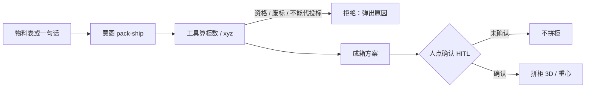
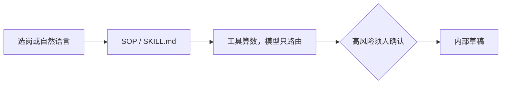

# PRD · 装箱岗用户路径（面试一页）

版本：2026.08.27  
入口：工作台 :8765 · 装柜台 :8000/workbench · 本页图 `user-flow.html`  
不是座舱、不是 RoboOS、不是可投标。

## 用户问题

现场问「这批料几个柜、坐标对不对」。模型不能写 xyz、不能拍柜数。

## 角色

物机 / 物流。持证人员仍要自己签认。`submit_blocked=true`。

## 用户路径

```
物料表或一句话
  → 意图落到 pack-ship
  → 工具算柜数 / 坐标 / 能否装下
      ├ 策略拒绝 → 弹出原因（资格 / 废标项 / 不能代投标）→ 停
      └ 算出成箱方案
          → 人点确认（HITL）
              ├ 不确认 → 不拼柜
              └ 确认 → 拼柜 3D / 重心
  → 高风险写盘须确认句：我明白，将由持证人员签认
```

工作台另一条：选 66 岗之一 → 走该岗 SOP → 内部草稿。不自动判定可开工。

## 验收

| 项 | 怎么验 |
|----|--------|
| 模型不写 xyz | 坐标只来自 packing 引擎 |
| HITL | 未确认不得拼柜 |
| 拒绝有原因 | 策略引擎弹理由，不是静默失败 |
| 评测 | 128 次 pipeline（16×8）可复跑 |
| 红线 | 不写可投标、不是客户签认件 |

流程图见下（GitHub 原生渲染 Mermaid）；`user-flow.html` 为同一内容的本地 HTML 版。

## 用户路径（流程图）

装箱主路径：



工作台路径（66 岗）：



高风险写盘确认句：`我明白，将由持证人员签认`。草稿不是签认件，不判定可开工。
