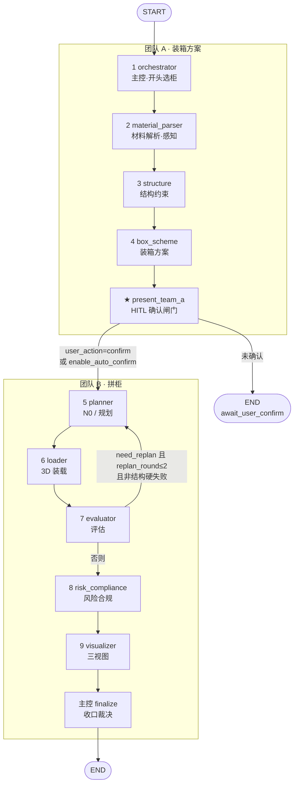
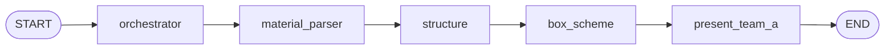
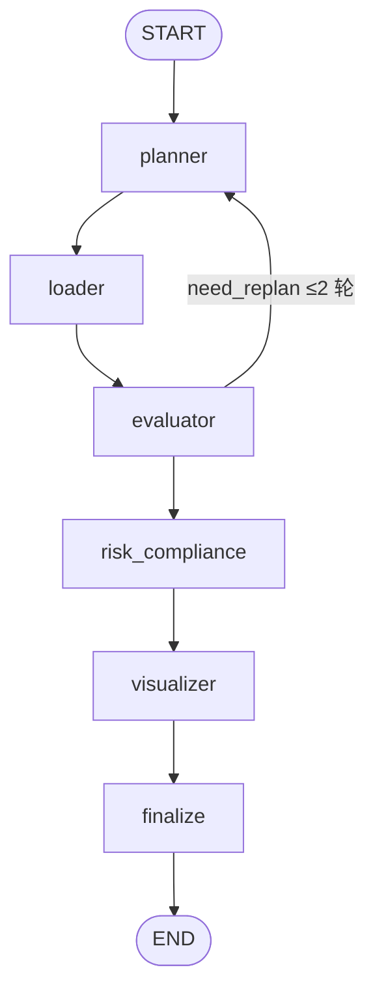

# 当前 LangGraph 编排图

源码：`packing_assistant/graph.py`  
状态：`PackingState`（`packing_assistant/state.py`）  
节点包装：`instrument_node`（写 traces）

示意大图：[`diagrams/langgraph-create-app.jpg`](diagrams/langgraph-create-app.jpg)

---

## 1. 全图 `create_app()` / `build_graph()`

demo / `run_pipeline(enable_auto_confirm=True)` 使用此图。  
`present_team_a` 后若 `user_action==confirm` 或 auto 已确认 → 进入团队 B；否则 **END**（等 HITL）。



### 条件边（代码对应）

| 源节点 | 路由函数 | 条件 | 去向 |
|--------|----------|------|------|
| `present_team_a` | `_after_present` | `user_action=="confirm"` | `planner` |
| `present_team_a` | `_after_present` | 否则 | `END` |
| `evaluator` | `_after_evaluator` | `REJECT_STRUCTURE` 或结构失败箱 | `risk_compliance` |
| `evaluator` | `_after_evaluator` | `need_replan` 且 `replan_round≤2` | `planner`（回环） |
| `evaluator` | `_after_evaluator` | 否则 | `risk_compliance` |
| `risk_compliance` | （固定边） | 始终 | `visualizer`（硬阻断也出图，finalize 打回） |

---

## 2. 仅团队 A `create_team_a_app()`

`run_team_a` / `enable_auto_confirm=False` 且只跑 A：



结束后 `phase=await_user_confirm`；用户 `POST /api/confirm` 后 harness 再调 **Team B 子图**。

---

## 3. 仅团队 B `create_team_b_app()`

确认后拼柜：



---

## 4. Harness 与图的关系（非图内节点）

```text
run_pipeline(auto_confirm=True)
  → create_app().invoke(state)     # 全图一气呵成

run_team_a
  → create_team_a_app().invoke     # 停在 present

apply_user_confirmation + run_team_b
  → create_team_b_app().invoke     # 从 planner 起

run_agent_pipeline（逐步）
  → 不经 LangGraph，顺序调同一批 agent_* 函数
  → 逻辑与全图一致，便于 trace / 落盘
```

---

## 5. 节点 → 主要 tools（一句话）

| 节点 | tools / 职责 |
|------|----------------|
| orchestrator | `container_select.recommend_container`，goal |
| material_parser | 解析材料 → `perception` |
| structure | 结构约束 / 箱型建议 |
| box_scheme | `packing.run_packing` 或 crate_passthrough |
| present_team_a | `hitl.confirm_gate` |
| planner | `booking.compute_booking`，`planning_reasons` |
| loader | skjolber 或 `pack_with_auto_containers` / bin3d |
| evaluator | 双利用率评分，`need_replan` |
| risk_compliance | 规则合规，`suggested_actions` |
| visualizer | 三视图 PNG |
| finalize | 柜型复核 + `goal_status` 裁决 |

---

## 6. 文字简图（答辩可抄）

```text
START
  │
  ▼
orchestrator ──► material_parser ──► structure ──► box_scheme
                                                      │
                                                      ▼
                                              present_team_a
                                               │           │
                                    confirm/auto         未确认
                                               │           │
                                               ▼           ▼
                                            planner       END (HITL)
                                               │
                                               ▼
                                            loader
                                               │
                                               ▼
                                           evaluator ◄── replan≤2
                                               │
                                               ▼
                                        risk_compliance
                                               │
                                               ▼
                                          visualizer
                                               │
                                               ▼
                                           finalize ──► END
```
