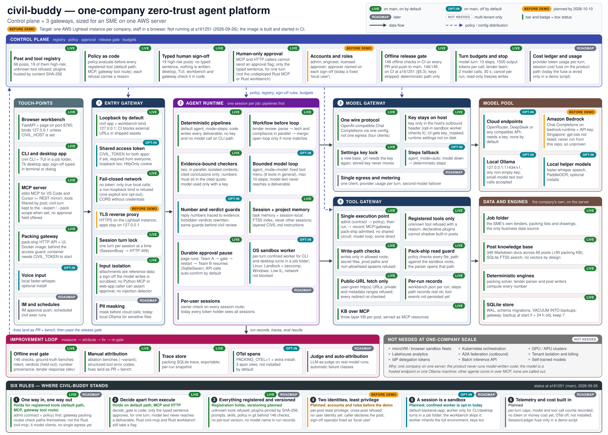

Repository: <https://github.com/LUOaini1213/civil-buddy> (MIT licence) · Code baseline: `main` at `d3ada11`, 2026-09-26

Every result we claim was produced on that checkout, offline, with no model key; the release-gate result is GitHub CI's run on that commit (§5.3). The few older figures we mention are labelled as archived. Appendix A names the command or file behind each number and strong claim. Each part of the architecture carries one status tag:

| Tag | Meaning |
|---|---|
| `LIVE` | On `main`, on by default. |
| `OPT-IN` | On `main`, off by default. |
| `BEFORE DEMO` | Planned by demo day, 2026-10-10. |
| `ROADMAP` | Planned after the demo. |
| `NOT NEEDED` | Needed only by a multi-tenant platform, so left out on purpose. |

## 1. Summary

**Problem.** A small construction or civil-engineering firm has the same paperwork as a large one, with a handful of people to do it. It checks its bid against the tender, plans how steel frames and precast units are crated and containerised, and writes daily reports, safety briefs and office documents. The expensive mistakes are numbers and verdicts: a wrong container count, a missed tender requirement, or a "compliant" that nobody checked. A general chat assistant is fluent at exactly those. It invents numbers and states conclusions.

**What civil-buddy does.** civil-buddy is a local-first agent workbench with 66 job "posts" in 16 categories. The categories include tender review, packing and shipping, site documents, design disciplines, HR, admin, IT and finance. Staff use it through a browser workbench, a CLI, a desktop app, an MCP server for VS Code and Cursor, or a packing gateway. A post turns the user's words and the files in a job folder into an internal draft in Markdown, Word and Excel. Missing values stay `UNSPECIFIED` or 待填 ("to be filled"); they are never guessed.

**Why it is safe to trust.** Four properties are enforced in code, not in prompts.

1. **Code computes every number.** A model (any OpenAI-compatible endpoint) may plan and phrase, but its text never reaches a deliverable.
2. **A person approves high-risk work.** The 19 high-risk posts write nothing until a person types 我明白，将由持证人员签认 ("I understand; a licensed person will sign"), and the approval covers only the turn it was typed in. Since the security baseline (pull request #61), this holds over the Python MCP server and both web apps as well as in the desktop app, the TUI and the workbench: a program cannot approve by sending a flag (§4.3). Two separate Rust tools that are not deployed still accept a flag (§4.4). Every draft carries `submit_blocked = true`.
3. **Policy as code.** Every registered tool call on the default path, over MCP and through the gateway's tool route first passes a policy function that refuses with a stated reason.
4. **An offline release gate.** 142 checks run in CI on every pull request and push to `main`. All 142 pass on `main` at this baseline (§5.3).

**Headline numbers:**

- **Tender vs bid-response matcher** (19-case development set): link precision 1.000 and recall 0.980. All 14 gold number conflicts are found, and no false conflict is raised.
- **Held-out sets:** the task-intent router scores 1.000 with 0 false runs on 18 unseen sentences. The verdict guard scores precision 0.900 and recall 1.000 on 20 unseen sentences.
- **Cargo conservation:** pieces in equal pieces out on all 50 tracked packing fixtures (3 571 pieces).

**The honest counterweight.** Across 65 posts, only 350 of 1 529 stated facts (0.229) land in the right field. The three bid posts and the warehouse post score 1.00; the other 61 place fewer than half.

**Where it runs.** The target is one AWS Lightsail instance per company, used by employees in a browser. At this baseline the instance is not yet running. We plan to set it up before submitting and to give its URL in the submission email (§6).

**Pilot partner.** We propose to pilot civil-buddy with a Singapore curtain-wall contractor, {{SME_NAME}}. So far the partner has given verbal feedback only, and no pilot has been agreed or started. The demo on 10 October will walk the partner's three façade jobs on synthetic files (§3.4): reviewing a façade tender, planning how unitised panels are crated and containerised, and drafting installation paperwork behind the licensed sign-off. The Business Proposal describes the partner and the proposed pilot.

## 2. Architecture

### 2.1 The one-company version of a zero-trust agent platform

A reference zero-trust agent platform has a control plane; entry, model and tool gateways; a runtime in which every session is a sandbox; a data layer; and an improvement loop, all held together by six rules (§2.3). It is drawn for an enterprise running many agents for many users and tenants.

civil-buddy is **its one-company, one-server version**: the same regions, sized for one firm on one Linux instance, with each box tagged in §2.2 by what exists today. The per-agent core already runs on `main`: a fixed workflow before any open loop, policy as code, typed human sign-off, a fixed menu of registered tools, two parallel evidence-bound checkers, an offline gate and, since pull request #61, one access guard in front of both web apps. Multi-tenant infrastructure is left out on purpose (§2.4).



*Figure 1. civil-buddy as a one-company zero-trust agent platform. The status tags are those of the legend (top right) and of the table at the start of this document.*

### 2.2 Regions and status

`policy.py`, `tool_engine.py`, `model_loop.py`, `memory.py`, `civil_config.py` and `os_sandbox/` are in `packing_assistant/runtime/`.

| Region / part | Status | What is true at `d3ada11` |
|---|---|---|
| **Control plane** | | |
| Post and tool registry | `LIVE` | 66 posts, 19 of them high-risk (`workbench/seed.json`). Unknown tools are refused. Declarative plugins cannot shadow a built-in post and are trusted by content SHA-256. |
| Policy as code | `LIVE` | `policy.evaluate` runs before each registered tool. It has 9 deny codes, each with a reason: unknown tool, write from a chat turn, another post's exclusive tool, sandbox, production path, secret file, circuit breaker, budget, cancelled (`policy.py:20-29, 103-224`). It also checks any `file_path` argument against the sandbox roots (`policy.py:172-180`). |
| Typed human sign-off | `LIVE` | No typed sentence, no write on a high-risk post. The desktop app, the TUI, the workbench server, the packing gateway and `civil serve` check the sentence in code (`civil_config.py:171-190`, `demo/chat_service.py:349`, `gateway/app.py:479-497`). On the CLI, `--confirm` is the local operator's own assertion. |
| Human-only approval, MCP and HTTP | `LIVE` | MCP never advertises or accepts `confirm_ok` or `p0_confirmed`; a high-risk write over MCP returns `approval_required` and writes nothing (`demo/mcp_surface.py:102, 133-134, 297-333, 358`). The gateway and `civil serve` accept only `confirm_text` equal to the sentence; a `true` boolean is refused (HTTP 422 on the gateway). The workbench's `confirm_ok` field no longer approves. In model mode an approval covers that turn only (`memory.py:85`). The undeployed Rust `civil-mcp` and Rust workbench still accept a flag (§4.4). |
| Accounts and roles | `BEFORE DEMO` | Admin, engineer and licensed approver; each sign-off names its approver. Today: one shared token, and the operator is recorded as 本地用户 ("local user"). |
| Offline release gate | `LIVE` | 142 checks, run by `npm run check` in CI with model keys stripped. It covers the deterministic path only. 142 of 142 pass on GitHub CI at `d3ada11` (§5.3). |
| Turn budgets and stop | `LIVE` | Model loop: at most 10 steps, and 1 500 output tokens per call. Tender workflow: 2 model calls and 30 s. Cancel per run or per session; a read-only config freezes writes. |
| Cost ledger and usage | `ROADMAP` | The `SessionLedger` fuse is wired only in a demo script (`tool_engine.py:84`: `ledger = None`). No token or money cost is recorded. |
| **Touch points and entry gateway** | | |
| Browser workbench, CLI and desktop app; loopback by default | `LIVE` | FastAPI on port 8765, bound to 127.0.0.1 unless `CIVIL_HOST` is set; a non-loopback host without `CIVIL_TOKEN` refuses to start. The `civil` CLI and TUI run in a job folder; there is also a Tk desktop app. CI blocks external URLs in shipped assets. |
| MCP server; KB over MCP | `LIVE` | MCP over stdio (JSON-RPC), used by VS Code and Cursor; the workbench and gateway mirror the tool list, tool calls and KB resources as REST routes under `/api/mcp/*`. Tools are scoped per launch: 8 (`--pack construction`, the first server in the shipped IDE configs), 9 (`--pack bid`) and 13 (`--expert pack-ship`). Within a `--pack` or `--expert` scope, `civil.turn` runs only posts inside it (`demo/mcp_surface.py:304-315, 369-373`); a launch with neither flag lists 11 tools and does not restrict `civil.turn` (it still cannot approve). The knowledge base is exposed as MCP resources. A separate Rust `civil-mcp` binary in `workbench/` is not part of the deployed surface (§4.4). |
| Packing gateway | `LIVE` | Pack-ship API, page and Docker image, behind the same access guard as the workbench. The container refuses to start without `CIVIL_TOKEN`. |
| Voice · IM approvals and schedules | `OPT-IN` · `ROADMAP` | Voice: local faster-whisper, an optional install. IM approvals and schedules: not built. |
| Shared access token | `OPT-IN` | One `CIVIL_TOKEN` for both apps, off by default. When set it is required on every route except the page shells, static files and `/api/health`, WebSockets included, and from loopback too, because behind a proxy every request is loopback. It is compared with `hmac.compare_digest`; `?token=` is accepted once and swapped for an HttpOnly, SameSite=Strict cookie (`packing_assistant/access_guard.py:101-106, 135-149`). |
| Fail-closed network | `LIVE` | With no token, only a request that really came from this machine passes. Any forwarding header, HTTP/1.0, a non-loopback `Host`, `Origin` or `Referer`, or a cross-site fetch makes it remote (`access_guard.py:60-78`). `demo/serve.py`, a `uvicorn --host` start and the container refuse a non-loopback bind without a token; `CIVIL_ALLOW_OPEN_LAN=1` is the one explicit opt-out. The gateway's CORS allows only same-machine origins, without credentials (`gateway/app.py:110-127`). |
| TLS reverse proxy | `BEFORE DEMO` | HTTPS on the Lightsail instance, with the apps on 127.0.0.1. The nginx settings are in `docs/deploy-minimal.md` (§6.2). |
| Session turn lock; input isolation | `LIVE` | One turn per session (HTTP 409 otherwise). Attachments are reference data. A sign-off sentence written by the model is scrubbed, and no caller of the Python MCP server or the web apps can assert the approval. No injection detector yet. |
| PII masking | `ROADMAP` | Nothing is masked before a cloud call. Today's safeguard: no key, or a local Ollama. |
| **Agent runtime** | | |
| Deterministic post pipelines | `LIVE` | Default `agent_mode = steps`: code writes every deliverable. No key is needed, and the CLI makes no model call. |
| Workflow before loop | `LIVE` | Tender review is a fixed DAG: parse, then technical ∥ compliance, then aggregate. The open loop runs only when no workflow matches. |
| Two evidence-bound checkers | `LIVE` | Two parallel children, each with its own copy of the handoff. An optional model analysis must cite its evidence and is stored as unverified (§4.1). |
| Bounded model loop | `OPT-IN` | `agent_mode = model`: a fixed menu of 8 registered tools (a question-only turn gets the 5 read tools; a turn bound to a CAD, planning or logistics project gets that page's own fixed menu) and at most 10 steps. The writer gets only the user's words and the named files (`model_loop.py:319-323`). |
| Number and verdict guards | `OPT-IN` | Check every model-mode reply, with one rewrite allowed. `civil review` runs the same checks on any document with no model. |
| Session and project memory | `LIVE` | Task memory and a session-local FTS5 index; neither reads other sessions. Layered `CIVIL.md` job instructions. The approval is not kept between turns. |
| Durable approval pause | `LIVE` | On the gateway page, which sends `enable_auto_confirm = false`, packing Team A stops at the gate and is checkpointed (LangGraph `SqliteSaver`); Team B resumes after a restart. An API caller that omits the field skips the pause (`enable_auto_confirm` defaults to true, `gateway/app.py:1390`). |
| OS sandbox worker | `OPT-IN` | A per-turn confined worker for CLI and desktop turns in a job folder. Linux: Landlock and seccomp. Windows: Low integrity, which blocks writes and spawn but not network. |
| Per-user sessions | `ROADMAP` | Today every token holder sees all sessions. |
| **Model gateway and pool** | | |
| One wire protocol | `LIVE` | OpenAI-compatible Chat Completions and one config resolver (`packing_assistant/llm.py:40-71`). Not yet a single egress: four clients build their own requests. |
| Key stays on the host | `LIVE` | The host puts the key only into the outbound `Authorization` header; the settings API returns `key_masked`, and runtime settings are never written to disk. One exception: the opt-in OS-sandbox worker inherits the host environment, keys included (`os_sandbox/__init__.py:116`). |
| Settings key lock | `LIVE` | A settings POST that moves `base_url` to another scheme, host, port or path is refused unless the key is typed again, so the stored key never goes to a new host (`demo/model_settings.py:33-42, 118-127`). |
| Steps fallback | `OPT-IN` | `agent_mode = auto`: if the model is down, the turn runs as deterministic steps. |
| Cloud endpoints; local Ollama and helper models | `OPT-IN` | OpenRouter, DeepSeek or any compatible API (no key by default). Locally: Ollama (`127.0.0.1:11434/v1`), faster-whisper, PaddleOCR. |
| Amazon Bedrock | `BEFORE DEMO` | Configurable through the same Chat Completions setting; it has never been run from this repository. In Singapore the endpoint this setting needs is available, but the models AWS's examples use are not listed there (§6.3), so whether it works from Singapore is not yet known. A verification run is planned before the demo. |
| Single egress and metering | `ROADMAP` | One client, provider usage per turn, failover to a second model. |
| **Tool gateway** | | |
| Single execution point; registered tools only; write-path checks | `LIVE` | `ToolEngine.admit` checks the tool's contract, then policy; `ToolEngine.execute` runs `admit`, then the tool, then records it, for 81 registered tools (71 of them write) (`tool_engine.py:174-222, 224`). Writes are confined to the allowed roots; secret files, production paths and spawns not on the allowlist are refused. Pack-ship over MCP and the gateway's `/api/mcp/tools/call` pass `admit` and then run without `execute`, on purpose (§4.3). The gateway's own packing routes (`/api/pipeline`, `/api/table/parse`, `/api/export/*`) do not pass the engine; they call the packing engine directly, with their own path checks. In the opt-in model loop some tools also call their function directly (for example `pack_plan` calls `run_plan` on a file inside the job folder) and only write through the engine. |
| Pack-ship read guard | `LIVE` | Policy checks `file_path` against the sandbox roots for every tool, and the pack-ship parser opens the resolved path it checked (`tools/pack_ship_mcp.py:310-332`). Gateway `/api/table/parse` confines `path=` to the sandbox roots whenever a token is set or the request is not from this machine (a token-less local request may still name any table it can read; `gateway/app.py:1491-1508`), `/api/run-pdf` takes a file name, not a path, and `/api/artifact` serves only the output folders. |
| Public-URL fetch only | `LIVE` | Only http(s) URLs the user supplies. Private, loopback, link-local and metadata ranges are refused, and every redirect is re-checked (`demo/uploads.py:480-530`). |
| Per-run records | `LIVE` | Each run writes a `workbench.json`, and the steps path records each tool's real `ok`. Tool events are not yet persisted. |
| **Data, knowledge, improvement loop** | | |
| Job folder; deterministic engines | `LIVE` | The firm's own tenders, packing lists and drawings are the only business data. The packing solver, tender parser and post writers compute every number. |
| Post knowledge base | `LIVE` | 436 files in a SQLite FTS5 index: 346 post documents and 90 packing documents. No vectors, by design: every excerpt is a literal quote a number can be traced to. |
| SQLite store | `LIVE` | WAL, migrations and `VACUUM INTO` backups. At start, the gateway backs up if the last backup is more than 24 h old, and keeps 7. |
| Offline eval gate; manual attribution; trace store | `LIVE` | The 142-check gate (§5). Ablation variants and error codes; fixes land as PR + bench. Exportable packing SQLite trace. |
| OTel spans | `OPT-IN` | `PACKING_OTEL=1` plus `requirements-observability.txt`. 3 span sites; not installed by default. |
| Judge and auto-attribution | `ROADMAP` | An LLM judge on real model runs, and automatic failure classes. |

### 2.3 The six rules

| Rule | Verdict, and what holds today | Gap → when |
|---|---|---|
| **1. One way in, one way out** | *Holds for every registered tool call:* on the default path, over MCP and on the gateway's tool route (`/api/mcp/tools/call`), each passes the engine's contract and policy check (`ToolEngine.admit`); on the default path `execute` then runs and records it. Pack-ship over MCP and the gateway tool route is admitted, then run without `execute`, on purpose (§4.3). The gateway's own packing routes (`/api/pipeline`, `/api/table/parse`, `/api/export/*`) call the packing engine directly, with their own path checks. | The Rust `civil-mcp` binary has its own tool path; it is not deployed → open (§4.4). One model protocol but four clients → single egress `ROADMAP`. |
| **2. Decide apart from execute** | *Holds on the default path, over MCP and over HTTP.* `decide_gate` is code. Only the typed sentence approves, and only for its turn; no program can send an approval flag to the Python MCP server or the web apps. In civil-buddy's own model loop, the model's tools have no confirm field. Model text never reaches a deliverable. | The Rust `civil-mcp` binary and Rust workbench still accept `confirm_ok`; neither is deployed → open (§4.4). |
| **3. Registered and versioned** | *Registration holds; versioning is planned.* Unknown tools are refused, and plugins are trusted by hash. Prompts, skills and policy sit in git behind the gate. | No per-tool or per-post version, no model name in run records, and runtime model switches skip the gate → `ROADMAP`. |
| **4. Two identities, least privilege** | *Planned.* Least privilege per post holds: a post cannot call another post's exclusive tools (`policy.py:137-145`). | No user identity: the post id is caller-declared, and the operator is recorded as "local user" → accounts `BEFORE DEMO`. |
| **5. A session is a sandbox** | *Planned; opt-in today.* A per-turn confined worker exists. | Off by default and bypassed by the workbench. The host is long-lived, and the worker inherits keys → `ROADMAP`. |
| **6. Telemetry and cost built in** | *Planned.* Per-turn caps; each model turn records `model_calls` and `tool_calls`. | No token or money cost, OTel off, and the fuse only in a demo → `ROADMAP`. |

### 2.4 What we deliberately do not build (`NOT NEEDED`)

These are left out because one company runs on one server:

| Not built | Why |
|---|---|
| microVM and browser sandbox fleets | The product runs no model-written code and has no browser tool, so one confined process per turn is enough. |
| Kubernetes and GPU clusters | The model is a hosted endpoint or a single Ollama machine. |
| A lakehouse | Run records fit in SQLite. |
| A2A federation | civil-buddy calls no outside agent; other agents come in through MCP. |
| Tenant isolation, tenant billing, delegation tokens | One install serves one company, and the job folder is the data source. Per-user isolation is on the roadmap. |
| Batch inference and self-trained models | The volume does not justify them; off-the-shelf endpoints plus deterministic code are cheaper and easier to audit. |

## 3. How it works: three flows

### 3.1 Tender review: tender file → parse → two checkers → aggregated review

**Entry.** In the workbench, the user uploads the tender and bid files and asks 全面检查投标响应 ("fully check the bid response"). Files can be tagged tender, response or reference. DOCX and text-layer PDF are read; a scanned PDF counts as unreadable unless OCR is installed. On the CLI the same request is `civil exec -C <job folder> "全面检查投标响应：招标文件.docx 投标函.docx …"`. In model mode the workflow is the `tender_compare` tool.

**Routing.** No model is involved. `task_router.route_task` picks the fixed `tender-review` workflow when the request contains a tender word, a word such as 全面 ("full") and a check word, or when all three bid posts are selected.

**Pipeline.**

1. `decide_gate` runs.
2. `tender_parse` extracts each requirement and locates its exact quote, with offsets.
3. `tender_response_match` finds candidate responses and numeric mismatches.
4. The handoff is frozen as `handoff.json`, with a SHA-256 hash.
5. Two checkers run in parallel (`ThreadPoolExecutor(max_workers=2)`) with no shared live state. **bid-tech** drafts a technical outline from the scoring points. **bid-compliance** builds the gap table: responses, numeric conflicts, unreadable files and hazard items.
6. `tender_review.review_draft` aggregates. Conflicts are listed as `needs_review` and never resolved automatically. `responses_verified` is always 0. `check.json` records every input's SHA-256 and what changed since the last run.

The output is 14 files: the handoff, `check.json`, and four drafts (tender extract, bid-tech, bid-compliance, collaboration review), each as `.md`, `.docx` and `.xlsx`.

**The person's part.** The person chooses the files and their roles, checks every candidate response, and submits and signs outside the product; `submit_blocked` is always true. If the tender cannot be read, the CLI stops with `tender_unreadable` and writes nothing. If a response file cannot be read, its rows become 未能判断 ("cannot judge"), never 未响应 ("no response").

**With and without a key.** Without a key, `model_calls = 0`. The CLI never passes a model, even when a key is set. With a key, in the workbench only, each checker makes one extra call under the rules in §4.1. The output goes to a separate `model-analysis.md` marked unverified. If the handoff does not fit the model's window, the model is skipped and nothing is truncated. The default 30 s deadline is untested with a live model.

**Measured.** We ran the bundled `cn_municipal` tender and three bid files through `run_agent`, the code behind `civil exec`:

- 72 requirements, all with a located quote;
- 51 response candidates, 0 marked verified;
- 84 open items and 3 conflicts;
- 0 forbidden claims and 0 model calls;
- 14 files in 1.6 s (2.4 s from the PDF, with identical counts).

On this set the bid check catches 6/6 planted defects with 0/8 false alarms. The set is now seen: its first held-out run, archived in the benchmark README, had 2/8 false alarms.

### 3.2 Packing and shipping plan: packing list → needs-human gate → crates and containers → approval → export

Three entries share one engine.

- **Packing gateway page.** `POST /api/table/parse` maps columns and units with `table_mapper` and computes nothing. `POST /api/pipeline` runs Team A: crates plus `check_conservation`. With the page's `enable_auto_confirm = false`, the run stops at `await_user_confirm` and is checkpointed. `POST /api/confirm` resumes Team B, which loads N containers of one type from the lower bound N0. `POST /api/export/shipment` writes the POR and lashing workbook.
- **CLI or chat on the pack-ship post.** `civil exec -C <job folder> "装柜方案 list.xlsx"` ("container plan") calls `pack_ship_solve.run_plan`, which runs the same mapper, gate, crating, loading and conservation check. The report copies its numbers from the JSON tool result. In model mode the model may call `pack_plan` only on a file it has listed.
- **Workbench `/logistics`.** A revisioned ledger. Packing runs in a killable subprocess with a 60 s cap and no API keys. A person applies any change a model proposes, checked against the ledger revision and a content digest.

**The gate.** No path yields a container count while any row lacks a usable weight or dimensions, has a quantity that is not a positive integer, or does not fit the container. Each such row gets one plain sentence. "3 EA" reads as 3; "10/12" is flagged, not read as 1012. If pieces or net mass differ between input and plan, the tool path returns `cargo_not_conserved` instead of a plan, and the gateway sets `ship_ok = false`.

**The person's part.** The person fixes or excludes each needs-human row. On the gateway they confirm, revise or cancel the crate list. On `/logistics` they confirm the ledger and type the sign-off sentence before packing and before export. CLI drafts are marked "not for booking; lashing and VGM signed separately". A model may choose tools, never coordinates or counts.

**Measured.**

- *Long-frame list (`case_b_long_frames_40hq.xlsx`) through the gateway:* 4 rows and 23 800 kg parsed, 9 crates, then a pause at `await_user_confirm`. After confirm: 3 × 40HQ, N0 = 2, `can_fit` true, resumed from disk, and a 5-sheet export. The CLI gives the same plan in 0.4 s.
- *Blocked inputs.* A list missing dimensions (`G7_missing_dims`) gives no plan and 3 needs-human rows. A crafted CSV with a blank weight and "10/12" gives 2 needs-human rows and nothing is stored. `/logistics` holds `case_b` for a person, because its dimension scope is not declared.

### 3.3 Site and office posts in steps mode, with no key

In the workbench, the user picks a post such as 项目日报 ("daily report"), or just types. On the CLI: `civil exec -C <job folder> "写一份项目日报；项目名称：…；日期：…"`, with `--skill` to force a post. The TUI and desktop app share `run_turn`.

1. **Routing.** An explicit selection, an `@mention` or a phrase table picks the post. A label that could mean two duties gets a question instead of a guess.
2. **Gate.** A high-risk post returns `hitl_pending` and writes nothing until the sentence is typed: on the card, in the TUI or in the dialog. On the CLI, `--confirm` is the operator's own assertion.
3. **Draft.** `run_agent` calls `tool_engine`, which runs policy first, then the post writer. The writer copies the stated facts into their rows. Gaps stay 待填 or `UNSPECIFIED`, and Word and Excel copies are exported. The benchmark counts 0 forbidden sign-off words.

**Measured through the real CLI entry.**

- The daily-report example went to `pm-daily` and placed all 6 stated facts.
- A meeting-logistics sentence mentioning 图纸会审 ("drawing review") went to two posts and left three stated fields `UNSPECIFIED`.
- A recruitment sentence mentioning 危大工程旁站 ("hazardous-works supervision") went to the high-risk `method-hazard` post and wrote nothing. With `--skill hr-recruit`, it wrote the brief.
- `safety-brief` wrote 0 files without `--confirm` and 3 with it.

Routing can misfire. For most non-bid posts, the draft is a correct skeleton that keeps the user's words but places fewer than half of the facts (§5.2).

### 3.4 The three flows on a synthetic façade job (pull request #63)

Pull request #63, merged on 2026-09-26 as `916971d` after this baseline, adds a runnable demo of the pilot partner's three jobs. Every input in `examples/facade-demo/` is synthetic and says so: a façade subcontract ITT, 24 unitised panels as English and Chinese spreadsheets, and daily-report and work-at-height inputs as Chinese labelled lines. `python scripts/demo_facade.py` copies them into a new job folder and runs each turn through `civil.run_task`, the function behind `civil exec`, in steps mode with no key; it writes nothing outside that folder. On `916971d` it printed:

- **Tender.** The parse lists the CR16 workhead, 420 calendar days, 90-day validity, the 10% performance bond, the 12-month defects-liability period, "alternative tenders not permitted", the 4 PQM weightings and 3 rejection clauses, and leaves 10 rows 未在原文检出 ("not found in the text") for a person. From its handoff, bid-tech drafts 4 chapters with 13 `[A001]` cells, and bid-compliance lists 8 requirements with no response and 3 rejection clauses to tick.
- **Packing.** 24 panels become 24 crates in 6 × 40HQ (N0 = 6, `can_fit` true, space 0.4387, weight 0.0903). Pieces 24 → 24 and 10 800 → 10 800 kg; all 24 crate structure checks read 待详设 ("pending detailed design").
- **Site documents.** The daily report copies the day's facts (date, weather, location, progress, attendance, plant, safety notes, next day's plan) into their rows and leaves the preparer and reviewer blank. The high-risk work-at-height briefing writes nothing, and the script never types the sentence.

The script also prints what it does not do yet: the parse lists 0 of the ITT's 8 façade specification clauses (mock-ups, heat soak, site water test, PE endorsement, warranty, A-frame delivery, insurance) and no liquidated-damages or retention row; the plan is identical with Chinese notes, English notes and none, and A-frame stillages are not modelled. The folder's README adds that, once signed, the briefing body is generic. The folder's README states that the ITT carries the same clauses as the ITT of our 26 September study, so any score on it is a development figure, not a held-out one.

**English requests.** The same pull request routes English requests in steps mode. On `heldout_en2`, 28 English sentences written after the English rules were frozen, `route_task` scores 0.786 accuracy with 0 false runs, and all 6 misses fall back to chat (`scripts/test_english_intents.py`). The two other English sets are not blind, so we do not quote them. The Chinese held-out 2 still scores 1.000 with 0 false runs on `916971d`. An English sentence still places almost nothing in a draft, which is why the demo's inputs are in Chinese.

## 4. Safety and governance

### 4.1 Human sign-off: the model proposes, code writes

The 19 high-risk posts cover structure, geotechnical, bridge, tunnel, fire protection, construction method and hazards, safety briefs, quality, survey, lab work and others. For these posts, `decide_gate` returns `hitl` until a person supplies the sentence. That check runs before the auto-approve setting, so no configuration removes it.

Inside civil-buddy's own model loop the model cannot approve: its tools have no confirm field, and if it copies the sentence, the sentence is replaced (`model_loop.py:785`). Since pull request #61 an external MCP host's model cannot approve either: the Python MCP server neither offers nor accepts an approval field (§4.3; the undeployed Rust `civil-mcp` still does, §4.4). `run_skill` also gives the writer only the user's words and the named files.

In tender review, a model analysis must be JSON that cites source ids and uses only numbers from the cited quotes. It is rejected if it says 可以投标 ("can bid"), 已通过审查 ("passed review") or 已确认合格 ("confirmed compliant") (`tender_workflow.py:117-146`).

No person is named on a sign-off yet; that comes with accounts, `BEFORE DEMO`.

### 4.2 Guards, policy and sandboxing

**Number provenance** (`tools/number_provenance.py`) flags any quantity or clause number that is missing from the turn's evidence: the user's text, tool results, knowledge-base excerpts and the files read. Exact matches count as evidence, and so do rounding, percent/decimal swaps and unit scaling. The check asks "is there a source?", not "is it right?".

**The verdict guard** (`tools/verdict_guard.py`) flags verdicts the product may never state: can bid, can start work, can book, passed review, complies with the tender. It ignores them when negated, asked or conditional.

In model mode, a flagged reply gets one rewrite. After that, untraced numbers are listed to the user and verdicts are struck. `civil review <document>` runs both guards with no model.

**Policy** is plain, tested Python. Since pull request #61 it also runs for pack-ship over MCP and the gateway's tool route, through the engine's admission step. We still do not say "every call": in the opt-in model loop some tools call their function directly, the gateway's own packing routes (`/api/pipeline`, `/api/table/parse`, `/api/export/*`) call the packing engine directly with their own path checks, and the undeployed Rust `civil-mcp` binary has its own tool path. `scripts/demo_agent_middleware.py` shows four beats. **Allow** lets a permitted call run. **Deny** stops bid-parse from calling `pack-ship__plan`. **Degrade** retries, then falls back to `UNSPECIFIED`. **Circuit** trips the cost fuse, which is attached only in that script. The run ends with `submit_blocked = true`, and its attempt to write a `.env` file is refused with a secret-file reason (`deny_secret`).

**Sandbox** (`OPT-IN`). With `sandbox_backend = os` or `auto`, a CLI or desktop turn in a job folder runs in a confined worker that is discarded when the turn ends. In steps mode, the whole pipeline runs there. In model mode, the file and write tools run there, while the model conversation stays in the host (it needs network). If `os` is requested and cannot start, the turn is refused (`runtime/turn.py:66-127`).

On our Windows test machine the probe enforces writes and spawn but not network; Linux Landlock and seccomp were not exercised. The hosted workbench bypasses the worker, and the worker inherits the host's keys. This is desktop hardening, not a server control.

### 4.3 The security baseline (shipped in PR #61)

Pull request #61 was merged as `d3ada11` on 2026-09-26 to make a public deployment defensible. It added three gate checks (`human-approval`, `access-guard`, `pack-ship-read-sandbox`) and extended `http-confirmation`. What changed:

1. **Approval only from a person, per turn.** MCP never advertises or accepts `confirm_ok` / `p0_confirmed`; a high-risk post over MCP returns `approval_required` and writes nothing. The gateway's routes and `civil serve` accept only `confirm_text` equal to the sentence, and a `true` boolean is refused (a 422 on the gateway). The workbench approves only on `confirm_text` or the sentence typed in the message. In model mode the approval no longer lasts the whole session: `memory.py` keeps it for this turn only. MCP `civil.turn` runs only posts inside the server's `--expert` / `--pack` launch scope.
2. **Only a token holder, or this machine, gets in.** `packing_assistant/access_guard.py` sits in front of both apps, WebSockets included. With `CIVIL_TOKEN` set, the token is required from everyone, loopback included, compared with `hmac.compare_digest`; `?token=` is swapped once for an HttpOnly, SameSite=Strict cookie. With no token, only a genuinely local request passes. `demo/serve.py`, a `uvicorn --host` start and the container refuse a non-loopback bind without a token; `CIVIL_ALLOW_OPEN_LAN=1` is the one explicit opt-out. The gateway's CORS no longer allows credentials.
3. **Settings key lock.** Changing the model `base_url` requires the key again.
4. **Pack-ship reads stay in the sandbox.** Policy checks `file_path` for every tool, and pack-ship over MCP and the gateway's tool route goes through `ToolEngine.admit` (contract, then policy). Gateway `/api/table/parse` confines `path=` to the sandbox roots whenever a token is set or the request is not from this machine (a token-less local request may still name any table it can read), and `/api/run-pdf` takes a file name.
5. **Smaller gateway fixes.** `/api/artifact` serves only the output folders, and the TMS mode comes only from the server environment, not the request body.

Three design choices are worth knowing.

- **Admit, not execute, for MCP and gateway pack-ship.** `execute` counts failures per tool and opens a process-wide circuit after three. Pack-ship returns `ok = false` for every list with a needs-human row, so on a shared server three such lists from one employee would switch pack-ship off for every employee. `admit` gives the same contract and policy check without that shared latch (`tool_engine.py:174-222`, `circuit=False`).
- **`tool_contracts` keeps `confirm_ok` and `p0_confirmed`.** The product's own steps path passes them to `engine.execute` after `decide_gate` has checked the typed sentence (`agent_loop.py:241, 260, 282`). Removing them from the shared contract would break that path. The cut is at the MCP and HTTP boundary, where a program is the caller.
- **The token is required from loopback too.** A reverse proxy on the same host makes every request arrive from 127.0.0.1, so trusting loopback while a token is set would let the internet in through the proxy. A "behind a proxy" flag was rejected because it fails open when forgotten.

### 4.4 Still open

Left open by pull request #61, and stated in it:

- **Rust tools.** The Rust `civil-mcp` binary and the Rust workbench still accept `confirm_ok` (`workbench/src/mcp.rs:173-176`; `workbench/src/api.rs:1292`). Neither is part of the deployed surface, although old Rust-workbench trial builds are on GitHub Releases.
- **Pack-ship circuit on the steps path.** The steps path still latches `pack-ship__plan`'s process-wide circuit after three needs-human lists in a row. Only a successful run resets the count, and none can run while the circuit is open, so on a shared server the workbench's packing post stays off for everyone until a restart (`tool_engine.py:354`; `policy.py:150`). This predates the baseline.
- **Run routes.** `/api/runs/compare` and the `{run_id}` routes join request values onto `RUNS_DIR` (`gateway/app.py:576, 2704-2710`). They are behind the token now.
- **Token-less proxying.** With no token, a proxy that rewrites `Host` and sends no forwarding header over HTTP/1.1 would look local. A proxied deployment must therefore set `CIVIL_TOKEN` (§6.2).

Older items that are still true:

- **Sandbox worker.** It inherits the host environment, keys included (`os_sandbox/__init__.py:116`), and its network is open on Windows.
- **Cost and telemetry.** The `SessionLedger` fuse is wired only in a demo script. OTel is off and not installed by default.
- **Audit.** The engine's audit log is in memory only, and tool events are not persisted. A failed tool on the model path still shows "done".
- **Identity.** No approver is named until accounts land (`BEFORE DEMO`).
- **Gateway packing pause.** `enable_auto_confirm` defaults to true for API callers (`gateway/app.py:1390`). This is the packing-plan pause, not the licensed-person gate.
- **Fetch and injection.** The URL fetch resolves DNS twice. There is no prompt-injection detector or test set.
- **Chat.** In the workbench, question-only turns call the model whenever a key is set, whatever `agent_mode` says.

## 5. Evaluation

### 5.1 How we measure

Every figure comes from a script in the repository, runs offline with no key, and exercises the deterministic path. Each set carries one of three labels:

- **Held-out:** written after the rules were frozen and not yet used to change them.
- **Dev:** used while building the rules.
- **Seen:** once held-out, since used to fix rules, and now a regression floor.

Model behaviour is outside the gate. Recorded live-model observations (`qwen2.5:3b`, `docs/civil-buddy/civil-codex-eval-2026-09-19.md`) are archived and were not rerun here.

### 5.2 Results

We re-ran every row on `d3ada11`. Apart from timings, the output is identical to our run on the previous baseline, `be18c6a`. Pull requests #60 and #61 changed none of these benchmark scripts (`git diff be18c6a d3ada11 --stat`); the one scoring script they touched, `eval_post_scorecard.py`, passes 35 of 35 posts.

| What is measured | Set | Result at `d3ada11` |
|---|---|---|
| Task-intent router: right post or workflow; no write from a question | held-out 2: 18 sentences, team-written | Accuracy 1.000, request recall 1.000, 0 false runs. The core rules before the change scored 0.556 accuracy and 0.111 recall. |
| Verdict guard: flag stated verdicts, not negated, questioned or conditional ones | held-out 2: 20 sentences, 9 must-flag | P 0.900, R 1.000 (tp/fp/fn 9/1/0). The v1 phrase list scored P 0.667, R 0.222. Small sample. |
| Number-provenance guard | dev: 37 drafts, 17 of them with 35 must-flag numbers and 20 clean | P 1.000, R 1.000 (35/0/0). Exact match alone scored P 0.729. |
| Tender requirement ↔ bid response | dev: 19 cases, 51 links, 14 conflicts | Links P 1.000, R 0.980 (50/0/1), F1 0.990. Conflicts 14/14, P 1.000. Per the benchmark README, the rules were extended after 5 cases were added (recall 0.765 → 0.980). |
| Synthetic tenders; bid check | 4 synthetic tenders read as 8 documents (`cn_construction` and `cn_municipal` as DOCX, PDF and OCR; `cn_consultation`; `cn_selection`) and 2 bid sets, dev or seen | `cn_construction`: fields 18/18, rejections 18/18. `cn_municipal`: 17/17 and 22/22 (OCR 21/22). Bid check: 5/5 and 6/6 defects, 0 false alarms. English fields: `en_itt` 16/16, `en_bds` 12/12. |
| Post content: are stated facts in the right field? | dev: 65 posts, 193 cases, 1 529 facts | 350 placed (0.229 micro, 0.241 macro); 112 misplaced, 309 dumped, 175 echoed, 583 missing, 0 forbidden. 4 posts at 1.00, 5 at 0.00. The bid posts' former held-out sets, now seen, rerun at 78/78, 70/70, 84/84 and 85/86. |
| Cargo conservation | 50 fixtures, 3 571 pieces | Pieces in = out on all 50. Mass is equal on 48; on the other 2 (`syn_overweight_risk`, `over_payload_monster`) the plan is 0.18 kg and 0.33 kg lighter, because a row's mass is split across crates. Seven fixtures split mass, and five of them still balance exactly. Long-frame list `case_b`: 9 crates, 3 × 40HQ, N0 2, `can_fit` true, 23 800 kg in = out, crate structure 9 pass / 0 fail. |
| Packing fan-out, 16 lanes × 8 rounds | fixture | 128/128 completed: `can_fit` is true on 71 runs and false on 57; 44 runs end in phase `done` and 84 in `need_revision`. 0 of 128 differ from the 2026-09-02 archive. Completion does not mean the cargo fits. |
| Acceptance, no-key demo, middleware | fixture | 12/12 PASS; `demo_one_shot.py --all` passed (exit 0); the four-beat middleware test passed. |

### 5.3 The gate at this baseline: 142 of 142 in CI

`npm run check` runs 142 default checks. On GitHub CI all 142 passed for pull request #61 (run 36170078042, on the PR head `fcd1c01`, whose tree is identical to `d3ada11`) and again on `main` at `d3ada11` (run 36171221472). All three CI jobs (smoke, rust, packing-eval-slice) succeeded in both runs, and the rust job's `cargo test` passed 156 tests on `d3ada11`.

Locally, `ui-dom` fails until `npm ci` has installed `node_modules`, because it needs `jsdom`; CI installs them (`ci.yml:47`). On our machine we re-ran the checks that #60 and #61 touched or added (`planning-chat-ui`, `post-scorecard`, `access-guard`, `human-approval`, `pack-ship-read-sandbox`, `http-confirmation`), and all six pass. The 5 Python checks that run only with `--full` also pass, including `pytest demo/tests` (76 passed, 9 skipped).

**Since this baseline: 145 checks.** Pull request #63 (merged 2026-09-26 as `916971d`) added three checks. `facade-tender` pins the tender-matrix fix: short Latin codes match whole words, so "CTU" in "structural" is no longer a lashing clause; a packing run is evidence only for the clauses it answers, so a clause on unmodelled handling (A-frame, stillage, upright, no stacking, fragile) or naming another container type goes to a person ("Pending SME") instead of "No Deviation", and a lashing or CTU clause is never covered by the run (at most "Partial Deviation"); and CR16 reaches the handoff. `english-intents` pins English routing, with floors on the three English held-out sets. `facade-demo` runs the flows of §3.4. All 145 checks passed on CI for the pull request (run 36222056643, on the PR head `46b6ac1`, whose tree is identical to `916971d`) and again on `main` at `916971d` (run 36222613544), and all three CI jobs succeeded in both runs. Locally on `916971d`, the three new checks, `task-intent-bench` and `tender-delivery-api`, which #63 also changed, pass (5 of 5).

`main` was red from 2026-09-22 until pull request #60; at `be18c6a` CI stopped at 137 of 139 (run 35688428017), and our local run there had 136. #60 fixed both failures, neither a product regression: `planning-chat-ui` now loads the ES modules that the #56 split made of `demo/static/app.js` (the same 9 tests and assertions), and `post-scorecard`'s bid-parse gate asks for the section `ad3d079` renamed to SKILL.md's "7 专项触发", with unchanged strictness.

### 5.4 What we do not claim

We do not claim the following:

- **Real tender PDFs.** First-run fields of 35/67, 52/70 and 29/39, and 0/13 on the first real English tender. The source files are outside the repository, so these results are only archived (`test/benchmarks/real_tender/README.md`).
- **A customer shipment.** The 446-tonne result (29 → 25 containers).
- **Earlier held-out scores.** First-run scores on sets now seen, such as 0.923 / 0.957 / 0.988 / 0.791.
- **"L2 66/66".** No command produces it.
- **Live models.** Any live-model or Bedrock result.

### 5.5 How to reproduce

From the repository root, with Python 3.11, `pip install -r requirements.txt` and no key; only `npm ci` needs the network. Appendix A lists the remaining commands.

```
python scripts/check_project.py --list           # 148 lines at d3ada11: 142 default + 6 --full (151 from 916971d)
npm ci ; npm run check                           # the release gate (ui-dom needs npm ci)
python scripts/eval_task_intent.py --check       # heldout2 1.000/0
python scripts/eval_verdicts.py --check          # heldout2 0.900/1.000
python scripts/eval_number_provenance.py --check
python scripts/eval_tender_response_match.py --check
python scripts/eval_post_content.py              # --set heldout_bid4 etc.
python scripts/test_real_tender.py ; python scripts/eval_real_bid_check.py --set bid_cn_municipal
python scripts/test_pack_ship_conservation.py --numbers
python scripts/fanout16x8_online_cargo.py --skip-fetch   # ~3 min, 16 workers
python scripts/test_acceptance_cases.py ; python scripts/demo_one_shot.py --all
python scripts/demo_facade.py                    # from 916971d: the façade demo of §3.4
python scripts/test_english_intents.py --score   # from 916971d: heldout_en2 0.786, 0 false runs
```

## 6. Deployment on AWS

### 6.1 Target and status

The enterprise edition is **one AWS Lightsail Linux instance per company**, used by employees in a browser. At `d3ada11` the instance is not yet running. We plan to set it up before the submission and to give the deployment URL in the submission email. What the server needs from the code is on `main`: the Docker build for the packing gateway (`Dockerfile`, `docker-compose.yml`, health check at `/api/health`), the access guard, and the operator guide `docs/deploy-minimal.md`.

| Layer | Design | Status |
|---|---|---|
| TLS on 443 | Caddy or nginx with a certificate, proxying to the apps on 127.0.0.1 | `BEFORE DEMO`. The guide gives the nginx settings; no proxy config file ships. |
| Applications | Gateway container published on `127.0.0.1:8000` only; optionally the workbench from the repository on `127.0.0.1:8765`, with the same token, under its own host name behind the proxy (§6.2 item 7). The image holds only the gateway. | Fail-closed start `LIVE`: without `CIVIL_TOKEN`, the container, `demo/serve.py` and `uvicorn --host` on a non-loopback address refuse to start. |
| Access | One `CIVIL_TOKEN` for both apps, required on every API route and WebSocket (only page shells, static files and `/api/health` are open); then three roles | Token and guard `LIVE`; roles `BEFORE DEMO` |
| Model key and egress | Key held in the server environment, never sent to the browser; a new base URL needs the key again. Egress only to the model endpoint and public URLs the user gives. | `LIVE` |
| Data | Job folders and SQLite (WAL) on the instance disk; gateway backups, keeping 7 | Backups `LIVE`; Lightsail snapshots `ROADMAP` |

### 6.2 Operator settings for the server

`docs/deploy-minimal.md` sets these rules for the Lightsail server. The guide also covers Render, Railway and a generic Linux host; this document describes only the Lightsail setup.

1. **Token.** `CIVIL_TOKEN` is mandatory: a long random value, kept only in the server's `.env`, never in the repository. Both apps use the same token, because their cookie has one name and no port scope, so two tokens would clear each other's cookie. `docker compose` refuses to start without it. To change the token, change the value and restart; old cookies then get a 401 and are cleared.
2. **No open LAN.** Never set `CIVIL_ALLOW_OPEN_LAN` on a server. It is the one opt-out that lets a token-less app accept requests from other machines.
3. **Only 80 and 443.** The shipped `docker-compose.yml` publishes `8000:8000` for a laptop; on the server it becomes `127.0.0.1:8000:8000`, and the Lightsail firewall opens 80 and 443, not 8000.
4. **Proxy.** Caddy or nginx terminates TLS and proxies to `127.0.0.1:8000`. For nginx the guide sets HTTP/1.1, `Host`, `X-Forwarded-For`, `X-Forwarded-Proto` and the WebSocket upgrade headers. A request with a forwarding header, or over HTTP/1.0, counts as remote, and the token is required from loopback too, so no proxy configuration bypasses it. `X-Forwarded-Proto: https` makes the cookie `Secure`. Do not set uvicorn's `FORWARDED_ALLOW_IPS` to `*`.
5. **Domain root.** Serve the app at the domain root (`location /`). Under a sub-path, the `?token=` redirect returns to the domain root.
6. **First visit.** Each employee opens `https://<domain>/?token=<token>` once. The server answers 303 to the same address without the token and sets an HttpOnly, SameSite=Strict cookie. That link appears once in the proxy log and the browser history, so it should not be forwarded. Scripts send `Authorization: Bearer <token>`.
7. **Workbench.** To serve the workbench as well, run `CIVIL_TOKEN=<same token> python demo/serve.py` (it binds 127.0.0.1:8765 by default) and give it its own host name at that name's root in the proxy (for example `wb.<domain>` → `127.0.0.1:8765`). The guide's nginx block covers only the gateway.
8. **Secrets and TMS.** Keys live only in environment variables, never as files in the repository root or `output/`; `/api/artifact` reads only `output/`, `PACKING_OUTPUT_DIR` and the runs folder. Leave `PACKING_TMS_MODE` unset, which keeps the TMS a stub.

**Why the token is mandatory behind a proxy.** With no token, a proxy that rewrites `Host` to 127.0.0.1 and sends no forwarding header over HTTP/1.1, or any TCP port forward (socat, `netsh portproxy`, `ssh -R`), makes a remote request look local. A token-less instance must never be exposed that way.

### 6.3 Model endpoints

| Endpoint | Configuration | Status |
|---|---|---|
| None (default) | No key: every post runs deterministically. | `LIVE` |
| OpenRouter, DeepSeek or any compatible API | `CIVIL_API_BASE`, `CIVIL_API_KEY` and `CIVIL_MODEL`, or Settings → Model in the workbench (held in memory only). | `OPT-IN` |
| Amazon Bedrock Chat Completions | Base URL `https://bedrock-runtime.<region>.amazonaws.com/openai/v1`, with a Bedrock API key as the bearer token, in the same setting. For Singapore (`ap-southeast-1`), AWS's documentation, checked on 2026-09-26, lists the `bedrock-runtime` endpoint as supported and the `bedrock-mantle` endpoint as not supported. Its model table does not list for Singapore the gpt-oss models that AWS's Chat Completions examples use. So it is not established that Bedrock's OpenAI-compatible Chat Completions works from Singapore with a model we could use. | `BEFORE DEMO`. **Configurable, never run** from this repository. A verification run is planned before the demo. |
| Local Ollama | `http://127.0.0.1:11434/v1` with any non-empty key. On Lightsail it would share the instance, so it suits laptop and on-premises editions. | `OPT-IN` |

### 6.4 Settings reference

| Setting | Default | Effect |
|---|---|---|
| `CIVIL_TOKEN` | empty | One token for the workbench and the gateway (`Authorization: Bearer`, or the cookie set by `?token=`). Empty: only genuinely local requests are served. |
| `CIVIL_ALLOW_OPEN_LAN` | unset | `1` lets a token-less app accept requests from other machines. Never on a server. |
| `CIVIL_HOST` / `CIVIL_PORT` | `127.0.0.1` / `8765` | Workbench bind address and port. A non-loopback host without `CIVIL_TOKEN` refuses to start. |
| `CIVIL_API_KEY` / `CIVIL_API_BASE` / `CIVIL_MODEL` | unset | Model endpoint; no key, no model |
| `CIVIL_MODEL_MAX_TOKENS` | `1500` | Output cap per model call |
| `CIVIL_AGENT_MODE` | `steps` | `model` or `auto` enables the model loop |
| `CIVIL_SANDBOX` / `CIVIL_APPROVAL` / `CIVIL_SANDBOX_BACKEND` | `workspace-write` / `on-request` / `app` | `read-only` freezes writes. No approval setting lifts the high-risk sentence. `os` or `auto` enables the confined worker. |
| `PACKING_TMS_MODE` | unset (stub) | Only the server environment selects a live TMS; a request body cannot. |
| `CIVIL_JOB_ROOT` · `CB_STORAGE` · `PORT` · `PACKING_OTEL` | unset · `sqlite` · `8000` · `0` | Job root · storage · gateway port · OTel |

## 7. Limitations and roadmap

| Item | Today (`d3ada11`) | When |
|---|---|---|
| Lightsail instance behind TLS | Not yet running; the operator guide is on `main` (§6.2) | `BEFORE DEMO`; planned before the submission, URL to follow in the submission email |
| Accounts and roles (admin, engineer, licensed approver), with each sign-off naming its approver | One shared token; operator recorded as "local user" | `BEFORE DEMO` (by 2026-10-10) |
| Bedrock verification run | Configurable, never run from this repository; whether it works from Singapore is not yet known (§6.3) | `BEFORE DEMO` |
| Durable audit log of tool calls and approvals | A `workbench.json` per run; the engine's audit is in memory only | `ROADMAP` |
| Metering and budgets (usage per turn, session budget) | Per-turn caps and model-call counts only | `ROADMAP` |
| Admin console and kill switch | Cancel per run or session; read-only config | `ROADMAP` |
| OIDC single sign-on | None | `ROADMAP` |
| PII masking before cloud calls | None; a local Ollama keeps files on the host | `ROADMAP` |
| Per-user sessions, single egress, IM approvals, LLM judge | Not built | `ROADMAP` |

**Known limits, not yet scheduled.**

- **Security.** The items in §4.4, including the Rust `civil-mcp` binary and Rust workbench, which still accept an approval flag and must not be shipped as safe.
- **Quality.** Most non-bid post writers place fewer than half of the stated facts.
- **Packing.** A plan uses one container type (`container_mix_supported = false`). The report calls N0 a booking lower bound, but on small-carton lists it includes a geometric estimate and can exceed the containers used; that label needs correcting.
- **Input formats.** PDF packing lists are read only in known layouts, and scans need OCR.
- **Language.** The UI (`lang="zh-CN"`), the sign-off sentence and most templates are in Chinese. English tender parsing is reproducibly measured only on synthetic sets. The one archived real English tender scored 0/13 fields on its first run.

## Appendix A. Evidence

**Environment.** Checkout `d3ada11` (`main`, 2026-09-26), on Windows 11 with Python 3.11.5 and Node v24.19.0. Model keys were unset and `PYTHON_DOTENV_DISABLED=1` was set; the fan-out ran with `--skip-fetch`. No tracked file changed. `node_modules` was not installed, so `ui-dom` was not run locally. The release-gate result is GitHub CI's.

**After the baseline.** Every number in §3.4, the "Since this baseline" paragraph of §5.3 and row 13 below was run on `916971d` (`main` after pull request #63, 2026-09-26) in the same environment, with no key and `PYTHON_DOTENV_DISABLED=1`; the 145-check result is GitHub CI's. No other number in this document was re-run on `916971d`, so the baseline stays `d3ada11`.

**Harness.** Rows marked *harness* were run by short scripts outside the repository that call the repository's own entry points: `run_agent`, `packing_assistant.civil.main`, `run_plan`, and FastAPI `TestClient`.

| # | Claim | Source |
|---|---|---|
| 1 | 66 posts, 16 categories, 19 high-risk, 0 disabled | `workbench/seed.json` (via `demo/catalog_seed.py`); `risk:` in `.agents/skills/*/SKILL.md` |
| 2 | Sign-off sentence; high-risk check before auto-approve | `runtime/civil_config.py:16, 160-190` |
| 3 | 346 post documents; 436 indexed files | `git ls-files 'demo/kb/*.md'`; `kb_search.py:105-119` |
| 4 | Gate: 142 checks (+6 `--full`), keys stripped; 142/142 on CI; three CI jobs; rust job 156 tests passed; locally the six checks #60/#61 touched or added pass, `ui-dom` needs `npm ci`; `--full` Python 5/5 (pytest 76 passed, 9 skipped) | `scripts/check_project.py:25-179` (`--list`; `--only <name>`; `--full --only <name>`); `.github/workflows/ci.yml:3-7, 47, 147-148`; GitHub Actions run 36170078042 (PR #61, head `fcd1c01`, tree identical to `d3ada11`) and run 36171221472 (push to `main` at `d3ada11`) |
| 5 | §5.2 benchmark rows, re-run on `d3ada11` | `scripts/eval_task_intent.py`, `eval_verdicts.py`, `eval_number_provenance.py`, `eval_tender_response_match.py` (each `--check`); `test_real_tender.py`; `eval_real_bid_check.py --set`; `test_english_itt.py`; `eval_post_content.py [--set heldout_bid{,2,3,4}]`; `eval_post_scorecard.py --all-pilots`; `git diff be18c6a d3ada11 --stat` |
| 6 | §5.2 packing rows, re-run on `d3ada11` | `scripts/test_pack_ship_conservation.py --numbers`; `run_plan` on `test/benchmarks/excel/case_b_long_frames_40hq.xlsx`; `fanout16x8_online_cargo.py --skip-fetch` (`output/fanout16x8/rollup.json`: `can_fit` and `phase` per run) vs `docs/eval/fanout16x8-2026-09-02/` |
| 7 | Demos, acceptance, middleware | `main.py --demo`; `test_acceptance_cases.py`; `demo_one_shot.py --all`; `demo_agent_middleware.py` |
| 8 | Model-loop menu and caps; fuse; secret-file refusal | `model_loop.py:40, 53-80, 640-660`; `model_client.py:43`; `middleware.py:119`; `tool_engine.py:84`; `policy.py:23, 178, 194` (`deny_secret`) |
| 9 | 81 tools, 9 deny codes, MCP scopes and transport, sandbox probe | `tool_engine.default_engine()`; `policy.py:20-29`; `demo/mcp_surface.list_tools`; `test_mcp_stdio.py`; `test_pack_ship_solver_mcp.py`; `demo/mcp_stdio.py` and `ide/vscode/mcp.json`, `ide/cursor/mcp.json` (stdio launch only); `test_os_sandbox.py` |
| 10 | Flows 1–3 (§3), re-run on `d3ada11` | harness: `run_agent` on `test/benchmarks/real_tender/bid_cn_municipal.json`; `TestClient` on `gateway.app`; `civil.main(['exec', …])` |
| 11 | Security baseline and what remains open (§4.3–4.4) | `packing_assistant/access_guard.py:60-78, 101-106, 135-149, 159`; `demo/mcp_surface.py:102, 133-134, 297-333, 358, 369-389`; `gateway/app.py:110-127, 479-497, 576, 650, 767-781, 942, 1390, 1491-1508, 2704-2710, 2868, 2908`; `demo/app.py:66-67, 1126`; `demo/serve.py:23-29`; `demo/chat_service.py:349`; `demo/model_settings.py:33-42, 118-127`; `runtime/app_server.py:76-101`; `runtime/memory.py:85`; `runtime/policy.py:172-180`; `runtime/tool_engine.py:174-222`; `runtime/agent_loop.py:241, 260, 282`; `tools/pack_ship_mcp.py:310-332`; `workbench/src/mcp.rs:173-176`; `workbench/src/api.rs:1292`; `runtime/os_sandbox/__init__.py:116`; `model_loop.py:347-368`; tests `scripts/test_access_guard.py`, `test_human_approval.py`, `test_pack_ship_read_sandbox.py`, `test_http_confirmation.py` |
| 12 | Operator settings; Lightsail not yet running; Bedrock not yet exercised; Bedrock endpoints and models in Singapore | `docs/deploy-minimal.md` ("AWS Lightsail"); AWS Bedrock User Guide, accessed 2026-09-26: <https://docs.aws.amazon.com/bedrock/latest/userguide/endpoints-region-availability.html>, <https://docs.aws.amazon.com/bedrock/latest/userguide/inference-chat-completions.html>, <https://docs.aws.amazon.com/bedrock/latest/userguide/models-region-compatibility.html> |
| 13 | Pull request #63 at `916971d`: façade demo figures, English routing, Chinese held-out 2, three new checks (145/145 on CI), 5 of 5 local checks | `python scripts/demo_facade.py` (exit 0) on `examples/facade-demo/`; `scripts/test_english_intents.py --score` (`test/benchmarks/task_intent/heldout_en2.json`; README in that folder); `eval_task_intent.py --check`; `check_project.py --only facade-tender,facade-demo,english-intents,task-intent-bench,tender-delivery-api`; `check_project.py --list` (151 lines); GitHub Actions run 36222056643 (PR #63, head `46b6ac1`, tree identical to `916971d`) and run 36222613544 (push to `main` at `916971d`) |
